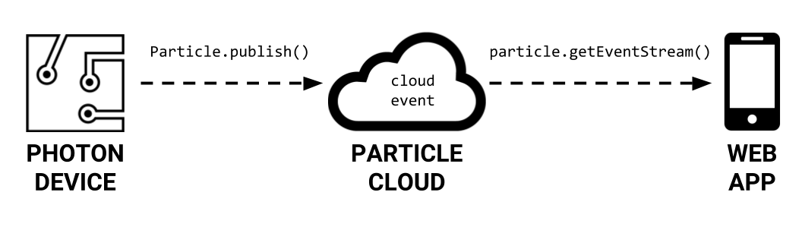

# Get Device Events

Your Photon device app can send event notifications to your web app through Particle Cloud. The event notification can also include data \(in the form of a text string\).

For example, your Photon device could monitor a building using motion sensors. If a sensor detects motion, an event notification could be sent to your web app to alert you. The notification could also include data, such as the location of the specific motion sensor that was triggered.  




Your Photon device app will use the `Particle.publish()` method to send an event notification through Particle Cloud. The event notification can also include additional data \(as text\).

A "cloud event" will be created that sends the event notification to your web app.

Your web app will use the `particle.getEventStream()` method to start listening for event notifications streamed through Particle Cloud.

By default, Particle Cloud will clear each cloud event after 60 seconds. This is to prevent your web app from receiving duplicate notifications or outdated notifications.

## Photon Device App

Your Photon device app will use the `Particle.publish()` method to send an event notification through Particle Cloud to your web app. The event notification can be sent with or without data.

Particle Cloud will allow your Photon device to send about 1 event notification per second. If your device sends event notifications more frequently than this, Particle Cloud will intentionally slow down your event stream, which can cause issues with your web app. To avoid this, you'll include a `delay()` of 1 second after each `Particle.publish()` statement.

### Send Event Without Data

An event notification can be sent without any additional data. It acts like a simple alert of a specific event or condition occurring.

Add this code \(**be sure to modify**\) in your Photon app wherever an event notification should be sent \(typically somewhere in the `loop()` function or a custom function\):

```cpp
Particle.publish("cloudEvent");
delay(1000); // 1 second delay after publishing event
```

In this case, the `Particle.publish()` method has just one parameter inside its parentheses:

1. **The cloud event name**, which can be up to 63 characters in length. The name must be listed within double quotation marks. Change `"cloudEvent"` to the actual name that you want to use.

### Send Event With Data

Alternatively, an event notification can be sent along with additional data in the form of text. It acts like an alert that contains additional information.

Add this code \(**be sure to modify**\) in your Photon app wherever an event notification should be sent \(typically somewhere in the `loop()` function or a custom function\):

```cpp
Particle.publish("cloudEvent", "data");
delay(1000); // 1 second delay after publishing event
```

In this case, the `Particle.publish()` method has two parameters inside its parentheses:

1. **The cloud event name**, which can be up to 63 characters in length. The name must be listed within double quotation marks. Change `"cloudEvent"` to the actual name that you want to use.
2. **The event data**, which is a text string that can be up to 255 characters in length. You can directly list the data as text within double quotation marks, or you can list the name of a String variable that stores the data. Change `"data"` to the actual text data \(or String variable name\) that should be sent with the event notification.

## Web App JS

Your web app JS will use the `particle.getEventStream()` method to start listening for event notifications streamed through Particle Cloud.

Add this code \(**be sure to modify**\) in your web app JS:

```javascript
particle.getEventStream({ deviceId: myDevice, name: "cloudEvent", auth: myToken }).then(function(stream) {
  stream.on('event', function(feed) {
    // add code to do something when event notification received
    // any text data received is stored as: feed.data
    
  });
});
```


**MODIFY CODE:**  You will need to make these changes to the example code above:

1. Change `"cloudEvent"` to the name of your cloud event whose value you want
2. Add code inside the `particle.getEventStream()` method to do something when an event notification is received. If the event notification includes text data, the data is stored as: `feed.data`


The `particle.getEventStream()` method requires your Photon device ID, the name of your cloud event, and your Photon access token:

1. `myDevice` is a global variable in your web app JS that should store your Photon device ID
2. `"cloudEvent"` is the name of your cloud event, which must be listed inside double quotation marks. Be sure to change `"cloudEvent"` to the actual name of your cloud event.
3. `myToken` is a global variable in your web app JS that should store your Photon access token

If an event notification includes any data, this text data gets temporarily stored in a local variable called: `feed.data`

You will need to add code within the `particle.getVariable()` method to do something when an event notification is received – and if applicable, do something with the text stored in `feed.data`.

For example, you could add code to:

* Display a message in your web app \(by using jQuery to modify the HTML\)
* Change the style of your web app \(by using jQuery to modify the CSS\)
* Save the text data in your web app \(by assigning its value to a JS global variable\)

