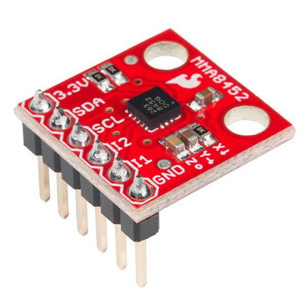
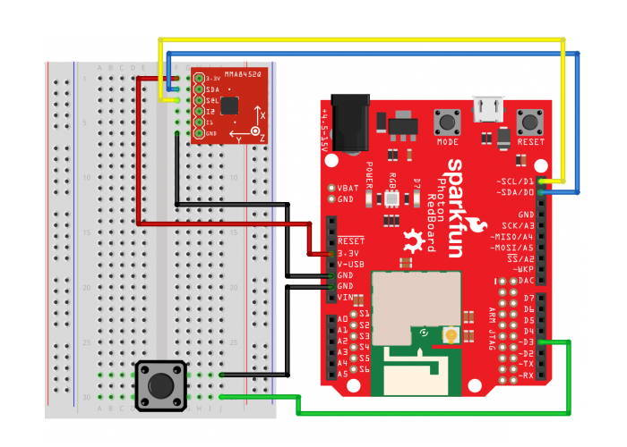

# Accelerometer

The triple-axis accelerometer included in your Photon kit can be used to detect changes in motion or orientation in 3 dimensions \(x, y, z\).



#### CHANGE IN MOTION \(TAP\)

Like the name implies, an accelerometer works by detecting acceleration – a change in motion. If a device with an accelerometer experiences a change in motion \(i.e., speeding up, slowing down, or changing direction\), the accelerometer can sense this change and measure the amount of acceleration in each of the 3 dimensions \(x, y, z\).

For example, fitness trackers use accelerometers to count steps by detecting changes in motion.

Your accelerometer is sensitive enough that it can be used to even tiny changes in motion caused by a nearby tap or bump. For example, if your Photon device is on a table, the accelerometer would be able to detect if you tapped the table with a finger.

#### ORIENTATION \(TILT\) {#orientation-tilt}

Even if a device with an accelerometer is **not** moving, the accelerometer can detect the orientation \(tilt\) of the device by measuring the acceleration due to Earth's gravity, which is a constant downward force acting on all objects. The accelerometer can determine if the object is parallel to the Earth's surface or if it's tilted.

For example, smartphones and tablets use accelerometers to sense the orientation of the device, in order to change the screen's orientation to match.

Your accelerometer can be used to measure the tilt \(in degrees\) for pitch and roll:

* **Pitch** is rotation on the Y-axis, which means an object is tilted up or down.
* **Roll** is rotation on the X-axis, which means an object is tilted right or left.


**NOTE:**  An accelerometer cannot measure **yaw** because Earth's gravity acts in the same direction as the Z-axis, which prevents the accelerometer from measuring rotation on the Z-axis. Instead, a different sensor called a **magnetometer** \(i.e., digital compass\) could be used to measure yaw by measuring an object's orientation relative to Earth's magnetic north pole.

## How to Connect Accelerometer

The MMA8452Q triple-axis accelerometer in your Photon kit has 6 pins located along its **front edge** \(which determines its orientation for measuring pitch and roll\). There are labels for each pin printed on the accelerometer circuit board. However, only 4 of the pins will need to be connected to your Photon.

To connect the accelerometer to your Photon using the breadboard, you will need:

* Accelerometer \(MMA8452Q\)
* 4 jumper wires \(use different colors to help identify them\)

| Accelerometer | Photon Pin |
| :--- | :--- |
| 3.3V | 3.3V |
| SDA | D0 \(SDA\) |
| SCL | D1 \(SCL\) |
| I2 | \(none\) |
| I1 | \(none\) |
| GND | GND |


**3.3V MAXIMUM:**  The accelerometer operates at 3.3V of power. Connect it to the 3.3V pin on your Photon, or connect it to a positive power rail that's connected to the 3.3V pin.

Do **NOT** connect it to VIN or V-USB because the higher voltage could damage it.


Here are the steps to connect the accelerometer to your Photon using the breadboard:

1. Insert the six metal pins of the accelerometer into **different** terminal strip rows on the breadboard. \(Different terminal strip rows have different row numbers.\)
2. Plug one end of a **jumper wire** into the **same** terminal strip row as the accelerometer's **3.3V pin**. Plug the other end of this jumper wire into the 3.3V pin on the Photon circuit board \(or to a **positive** power rail on the breadboard connected to the 3.3V pin\).
3. Plug one end of a **second jumper wire** into the same terminal strip row as the accelerometer's **SDA pin**. Plug the other end of this jumper wire into the D0 pin on the Photon circuit board.
4. Plug one end of a **third jumper wire** into the same terminal strip row as the accelerometer's **SCL pin**. Plug the other end of this jumper wire into the D1 pin on the Photon circuit board.
5. Plug one end of a **fourth jumper wire** into the same terminal strip row as the accelerometer's **GND pin**. Plug the other end of this jumper wire into a pin hole connected to GND:  either plug it into a negative power rail \(which is connected to GND via a different jumper wire\), or plug it directly into a GND pin on the Photon circuit board.

Here's a wiring diagram showing a possible way to connect the accelerometer \(ignore the wiring for the push button\):



Keep in mind that your connection can look different than this example diagram:

* Your accelerometer pins could be inserted into **different row numbers**. \(The example connects the accelerometer pins to rows 1-6 on the right side of the breadboard\).
* Your accelerometer pins could be inserted into a **different column** of the breadboard. \(The example connects the accelerometer pins into column H of the terminal strip rows\).
* Your accelerometer could connect \(through a jumper wire\) **directly to the 3.3V pin or to a positive power rail on the breadboard that's connected to the 3.3V pin**.
* Your accelerometer could connect \(through a jumper wire\) **either directly to a GND pin or to a negative power rail that's connect to a GND pin**. \(There are three available GND pins.\)

## How to Code Accelerometer

The basic steps to control the accelerometer in your app code are:

1. Include the SparkFun MMA8452Q library and Math library in your app.
2. Create a `MMA8452Q` object assigned to a global variable called `accel`.
3. Use the `accel.begin()` method to start the accelerometer in the `setup()` function. If app will detect taps, use the `accel.setupTap()` method to initialize the tap settings.
4. Use custom functions to detect taps or measure tilt angles using the accelerometer.

### Include Libraries

Your Photon app must include a code library that will allow you to control the accelerometer \(which is an MMA8452Q accelerometer\). You'll also add a Math library that will be used to calculate tilt angles.


1. In Particle Build, click on the Libraries icon to open the Libraries menu panel.
2. Type `mma8452q` into the search field. Select the result called:  **SparkFunMMA8452Q**
3. Click the button to "Include in Project"
4. Select the title of your Photon app, and then click the "Confirm" button

Particle Build will **automatically** insert this `#include` statement at the beginning of your app code:

```cpp
// This #include statement was automatically added by the Particle IDE.
#include <SparkFunMMA8452Q.h>
```

In addition, you will include a Math library that has additional mathematical functions and constants, which will be needed to calculate tilt angles. \(The Math library is available in Particle Build, but it won't show up in a search of the community libraries.\)

You need to **manually** add this `#include` statement \(after the other `#include` statement\):

```cpp
#include <math.h>
```

### Global Variable {#global-variable}

You need to create a new object using the `MMA8452Q` class in the included SparkFun MMA8452Q library, and assign this object to a global variable named `accel`.

Add this code statement **before** the `setup()` function:

```cpp
MMA8452Q accel;
```

### Start Accelerometer in Setup

The `accel.begin()` method is used to start the accelerometer, which will initialize its settings. \(You do **not** need to set any pin modes for the accelerometer.\)

Add this code statement within the `setup()` function to start the accelerometer:

```cpp
accel.begin(SCALE_2G, ODR_50);
```

The `accel.begin()` method can accept two parameters inside its parentheses \(in this order\):

1. **The scale range**, which determines the range and precision of the acceleration detection. The options for the scale are: `SCALE_2G`, `SCALE_4G`, or `SCALE_8G`. A higher scale can detect larger changes in acceleration but is less precise. A lower scale is more precise. For your app, using `SCALE_2G` is the probably the best choice because it will be the most precise.
2. **The output data range \(ODR\)**, which determines how frequently it outputs new measurements. The ODR is set in Hz \(number of times per second\). The options for the ODR are: `ODR_1`, `ODR_6`, `ODR_12`, `ODR_50`, `ODR_100`, `ODR_200`, `ODR_400`, or `ODR_800`. A higher ODR is faster \(more frequent\), while a lower ODR is slower \(less frequent\). If your device is being powered by a battery, a lower ODR is more energy-efficient. For your app, using `ODR_50` is probably a good choice.

Alternatively, you can exclude the parameters from the `accel.begin()` statement. If you do this, the accelerometer will default to using `SCALE_2G` and `ODR_800`.

#### SET UP TAP DETECTION

If your app will use the accelerometer to detect taps, then use the `accel.setupTap()` method to initialize the settings for tap detection.

**If detecting taps**, add this code within the `setup()` function \(**after** the `accel.begin()` statement\):

```cpp
    // set up tap detection
    byte threshold = 1; // 2 * 0.063g = 0.063g
    byte pulseTimeLimit = 255; // 0.625 * 255 = 159ms (max)
    byte pulseLatency = 64; // 1.25 * 64 = 640ms
    accel.setupTap(threshold, threshold, threshold, pulseTimeLimit, pulseLatency);
```

If your app will **NOT** be detecting taps, then this code can be excluded.

### Add Function to Check Tilt

If your app will use the accelerometer to detect an object's tilt, you'll add a custom function named `checkTilt()` that measures tilt angles for pitch and roll using the accelerometer.

Add this `checkTilt()` function **after** the `loop()` function:

```cpp
void checkTilt() {
    if (accel.available() == true) { 
        accel.read();
        float aX = float(accel.x);
        float aY = float(accel.y);
        float aZ = float(accel.z);
        int pitch = atan2(-aX, aZ) * 180 / M_PI; // rotation on Y axis
        int roll = atan2(-aY, aZ) * 180 / M_PI; // rotation on X axis        
        /*
        If accelerometer is level, pitch and roll will both be 0
        Pitch Up = 1 to 180, Pitch Down = -1 to -180
        Roll Right = 1 to 180, Roll Left = -1 to -180
        */     
        // add code to do something with pitch and roll
        
    }
}
```

You'll need to add code within the function to do something with the values of `pitch` and `roll`.

The values for pitch and roll indicate the direction\(s\) and angle\(s\) that the accelerometer is tilted.

Pitch is rotation on the Y-axis, which means the object is rotated up or down:

* If the accelerometer is **pitched up**, the pitch will be a **positive** angle \(between 1° to 180°\).
* If the accelerometer is **pitched down**, the pitch will be a **negative** angle \(between -1° to -180°\).

Roll is rotation on the X-axis, which means the object is rotated to the right or left:

* If the accelerometer is **rolled right**, the roll value will be a **positive** angle \(between 1° to 180°\).
* If the accelerometer is **rolled left**, the roll value will be a **negative** angle \(between -1° to -180°\).

When the accelerometer is **perfectly level**, the `pitch` and `roll` values will both be equal to `0`.

To check the tilt, call this function within the `loop()` function \(or within another custom function\):

```cpp
checkTilt();
```

### Add Function to Check Tap

If your app will use the accelerometer to detect taps, you'll add a custom function named `checkTap()` that detects taps using the accelerometer.

Add this `checkTap()` function **after** the `loop()` function:

```cpp
void checkTap() {
    if (accel.readTap() != 0) {
        // add code to do something if tap detected

    }
    else {
        // optional: add code to something if no tap detected
        
    }
}
```

The `accel.readTap()` method is used to detect a tap. The method returns a value of `0` when **no** tap is detected. When a tap is detected, the method returns a non-zero value. The `if` statement condition checks whether a non-zero value was returned \(indicating a tap was detected\).

You'll need to add code within the curly braces of the `if`statement to do something when a tap is detected. Optionally, you can add code within the curly braces of the `else` statement to do something when **no** tap is detected.

To check for a tap, call this function within the `loop()` function \(or within another custom function\):

```cpp
checkTap();
```

