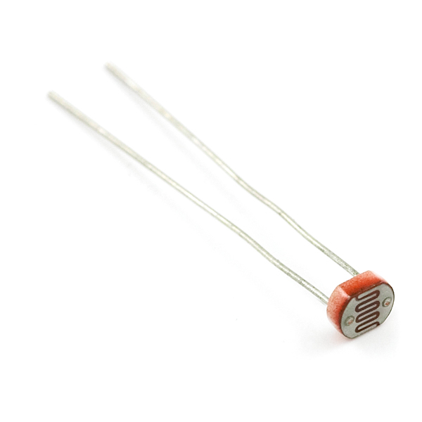
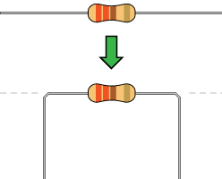
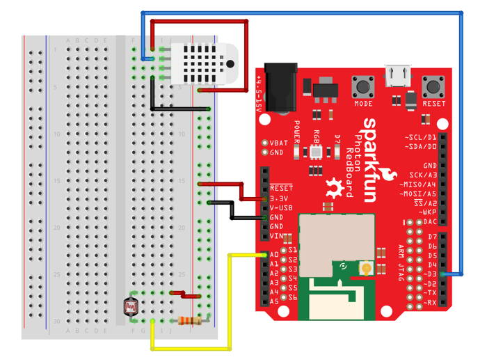

# Light Sensor

The Photon kit includes a light sensor \(also known as a **photocell**\) which is a variable resistor that changes its resistance in response to the amount of ambient light in the environment.



For example, some outdoor lights on houses and buildings use photocells to automatically turn the light on or off depending on whether it is dark or light outside. Most smartphones have light sensors to automatically adjust the brightness of the screen depending on the amount of ambient light detected.

## How to Connect Light Sensor

The light sensor is a **variable** resistor:  its resistance changes \(depending on the amount of light it is exposed to\).  A **static** resistor \(which has a fixed resistance\) will be connected in series with the photocell to create a [voltage divider](https://learn.sparkfun.com/tutorials/voltage-dividers). This will allow the Photon to measure the resistance of the photocell, which indicates the amount of light reaching the sensor.

### Bend Resistor Legs

A static resistor will be used to connect one leg of the light sensor to a GND \(-\) pin.

Your Photon kit contains a set of resistors with a resistance rating of 330 Ohms. In order to insert a resistor into the pin holes of a breadboard, you will need to bend both resistor legs into ~90° angles:



### Connect to Breadboard

The light sensor has 2 metal legs that will be inserted into pin holes on the breadboard. One of the legs will actually have **two** connections – this is the voltage divider created using a static resistor.

To connect a light sensor to your Photon using the breadboard, you will need:

* Light sensor \(aka photocell\)
* Resistor with bent legs
* 2 jumper wires \(use different colors to help identify them\)

| Light Sensor \(Photocell\) | Photon Pin |
| :--- | :--- |
| First Leg \(either one\) | 3.3V |
| Second Leg | \(1\) any analog I/O pin \(A0, A1, A2, A3, A4, A5\)\(2\) GND using resistor |


**3.3V MAXIMUM:**  Analog inputs, such as the light sensor, require 3.3V of power for accurate measurements. Connect the light sensor to the 3.3V pin on your Photon, or connect it to a positive power rail that's connected to the 3.3V pin.



**RESISTOR REQUIRED:** A static resistor will be used to create a voltage divider that allows the variable resistance of the light sensor to be measured.


Here are the steps to connect the light sensor to your Photon using the breadboard:

1. Insert the two legs of the light sensor into **different** terminal strip rows on the breadboard. \(Different terminal strip rows have different row numbers.\)
2. Plug one end of a **jumper wire** into the **same** terminal strip row as **one sensor leg**. Plug the other end of this jumper wire into the 3.3V pin on the Photon circuit board \(or plug it into a positive power rail that's connected to the 3.3V pin via a different jumper wire\).
3. Plug one end of a **second jumper wire** into the same terminal strip row as the **second sensor leg**. Plug the other end of this jumper wire into any analog I/O pin on the Photon circuit board.
4. Insert one end of the **resistor** into the **same** terminal strip row as the **second sensor leg**. Insert the other end of the resistor into a pin hole of the negative column of the closest power rail on the breadboard.
5. If the negative power rail isn't already connected to a GND pin on the Photon circuit board, then plug one end of a third jumper wire into another pin hole in the negative power rail, and plug the other end of this jumper wire into a GND pin on the Photon circuit board.

Here's a wiring diagram showing a possible way to connect a light sensor \(ignore the wiring at the top for the temperature sensor\):



## How to Code Light Sensor

The basic steps to control a light sensor \(photocell\) in your app code are:

1. Declare a global variable to store the I/O pin number for the light sensor.
2. Use the `analogRead()` method to measure the amount of light.
3. **OPTIONAL:**  Use the `map()` method to convert the sensor reading to a custom range.

### Global Variable

You should declare a global variable to store the I/O pin number that the light sensor is connected to. This will make it easier to understand your code \(and easier to modify the code if you were to connect the trimpot to a different pin number\).

Add this code statement \(modify if necessary\) **before** the `setup()` function:

```cpp
int light = A0;
```

This line of code does 3 things \(in order\):

1. **It declares a data type for the variable's value.**  In this case, `int` stands for integer \(whole number\). Photon pin numbers are always treated as `int` values \(even though they have letters\).
2. **It declares the variable's name.** In this example, the variable will be called `light`. You can change the variable name, but choose a name that will make sense to anyone reading the code.
3. **It assigns a value to the variable.**  In this example, the variable's value will be equal to `A0`. If necessary, modify this value to match the actual I/O pin that your speaker is connected to.


**PIN MODE:**  Analog inputs do **NOT** need to have their pin mode set within the `setup()` function. Their pin mode gets automatically set when the `analogRead()` method is used.


### Read Light Sensor Value

The `analogRead()` method is used to read the light sensor's value, which indicates the amount of ambient light reaching the sensor.

Add this code \(modify as necessary\) to your app within the `loop()` function or a custom function:

```cpp
int lightValue = analogRead(light);
// add code to do something with lightValue
```

A local variable named `lightValue` is declared that will have a data type of `int` \(integer\).  This variable is made equal to whatever value is returned by the `analogRead()` method.  You can change the name of this variable, but it will make sense if it's similar to the variable name used for the trimpot pin number.

The `analogRead()` method requires one parameter insides its parentheses: 

1. **The I/O pin number**, which can be the actual pin number \(such as: `A0`, etc.\) or a variable that stores a pin number. In this example, the variable named `light` is listed. If necessary, change this to match the variable name for your trimpot's pin number.

The `analogRead()` method will return an integer \(whole number\) value ranging from 0-4095:

* When there is **less light** detected, the reading will have a **lower value**.
* When there is **more light** detected, the reading will have a **higher value**.

You'll need to add code to do something with the reading stored as `lightValue`.

Depending on the specific purpose of the light sensor in your device, you may need to gather some test data under different conditions to see how dark or how bright the environment will actually be where your device will be used. This will help you determine which values to use in your code to make decisions. For example, if the light sensor will be used to turn on an LED light when a room is too dark, what value will be used to decide that the room is too dark?

### Map Value to Custom Range {#mapping-dial-position-to-custom-range-of-values}

In many cases, it may not be convenient to work with a value that ranges from 0-4095. Instead, it might be easier to have a value within a smaller custom range \(such as:  0-10, 0-100, etc.\) that makes more sense for your particular task.

The `map()` function can be used to convert a value from its original range \(such as 0-4095\) into a new range of your choice. You decide the minimum and maximum values for the new range.

For example, if the light sensor were being used to automatically turn on an LED light when the environment is too dark, you might want the sensor to return a value between 0-100 as an easier way to determine the relative brightness of the environment.

Add this code \(modify as necessary\) to your app within the `loop()` function or a custom function:

```cpp
int lightValue = analogRead(light);
int minValue = 0;
int maxValue = 100;
int mapValue = round(map(lightValue, 0, 4095, minValue, maxValue + 1));
// add code to do something with mapValue
```

As necessary, change the values assigned to `minValue` and `maxValue` to whatever numbers you want to use for your custom range. Also, the `minValue` **doesn't** have to be zero.

Be sure to add code to do something with `mapValue`.

**NOTE:** The code uses the `round()` method to round the mapped value to the nearest integer because the `map()` method returns a `float` \(decimal value\). Also, inside the `map()` method, the code intentionally adds 1 to the `maxValue` because otherwise it is very difficult to get the maximum value even if the ambient light in the environment is very bright.


