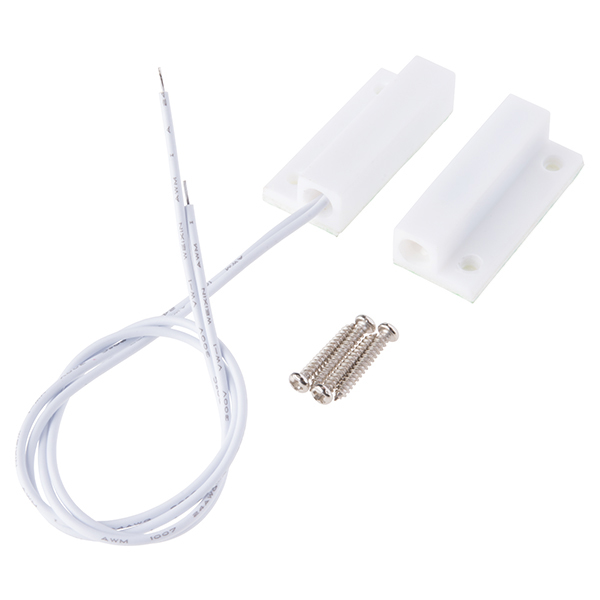
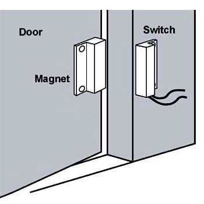
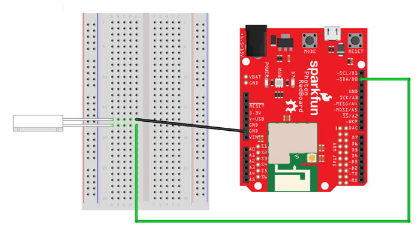

# Magnetic Switch

Your Photon kit includes a [magnetic switch](https://www.sparkfun.com/products/13247) that can be used to detect whether a door, window, drawer, box, etc. is open or closed.



The switch consists of two pieces, and it can detect whether these two pieces are close to each other:

1. The piece with the wires contains a [**reed switch**](http://www.explainthatstuff.com/howreedswitcheswork.html) that moves in response to the presence or absence of a magnetic field.
2. The other piece without the wires contains a **magnet**, so it can activate the reed switch when the two pieces are close to each other.

If the two pieces of the magnetic switch are within 20 mm \(0.75 inches\) of each other, the switch detects that it's "closed" – otherwise, the switch will detect that it's "open."

These magnetic switches are commonly used in security systems for doors and windows, but they are also used in many other products. For example, a doorbell uses a magnetic switch to detect when it is being pressed. Magnetic switches are also used in many laptops and tablets to detect when the lid/cover is open or closed, in order to automatically wake up the device or put it to sleep.

## How to Connect Switch

The reed switch \(the piece with the wires\) will be connected to the Photon. Then the reed switch will be attached to a **stationary** edge near something that opens \(such as:  door, window, drawer, etc.\). For example, the reed switch could be attached to the edge of a door frame – but **not** to the door itself.

The magnet \(the piece **without** wires\) would be attached to the object \(door, window, etc.\) that actually moves when opened. The two pieces of the magnetic switch should be positioned so they are very close together \(no more than 0.75 inches apart\) when the object \(door, window, etc.\) is closed.



To connect a magnetic switch to your Photon using the breadboard, you will need:

* Magnetic Switch
* 2 jumper wires \(use different colors to help identify them\)

| Magnetic Switch | Photon Pin |
| :--- | :--- |
| First Wire \(either one\) | any I/O pin |
| Second Wire | GND |

Here are the steps to connect the magnetic switch to your Photon using the breadboard:

1. Insert the two wires of the magnetic switch into **different** terminal strip rows on the breadboard. \(Different terminal strip rows have different row numbers.\)
2. Plug one end of a **jumper wire** into the **same** terminal strip row as **one switch wire**. Plug the other end of this jumper wire into an I/O pin on the Photon circuit board.
3. Plug one end of the **other jumper wire** into the **same** terminal strip row as the **other switch wire**. Plug the other end of this jumper wire into a pin hole connected to GND:  either plug it into a negative power rail on the breadboard \(which is connected to GND via a different jumper wire\), or plug it directly into a GND pin on the Photon circuit board.

Here's a wiring diagram showing a possible way to connect a magnetic switch:



Keep in mind that your connection can look different than this example diagram:

* Your magnetic switch wires could be inserted into **different row numbers** on either breadboard side. \(The example connects the switch wires to rows 17-18 on the left side of the breadboard.\)
* Your magnetic switch wires could be inserted into a **different column** on the breadboard. \(The example connects the switch wires into column A of the terminal strip rows.\)
* Your magnetic switch could connect \(through a jumper wire\) to a **different I/O pin**. \(The example connects to the D0 pin on the Photon circuit board.\)
* Your magnetic switch could connect \(through a jumper wire\) **either to a different GND pin or to a negative power rail connected to a GND pin**. \(There are three available GND pins on the Photon circuit board.\)

## How to Code Switch

The basic steps to use a magnetic switch in your app code are:

1. Declare a global variable to store the I/O pin number for the switch.
2. Set the pin mode for the switch pin in the `setup()` function.
3. Use a `digitalRead()` statement to check whether the switch is currently open or closed, and add code statements that should be performed depending on the result.

### Global Variable {#global-variable}

You should declare a global variable to store the I/O pin number that the switch is connected to. This will make it easier to understand your code \(and easier to modify the code if you were to connect the button to a different pin number\).

Add this code statement \(modify if necessary\) **before** the `setup()` function:

```cpp
int magSwitch = D0;
```

This line of code does 3 things \(in order\):

1. **It declares a data type for the variable's value.** In this case, `int` stands for integer \(whole number\). Photon pin numbers are always treated as `int` values \(even though they have letters\).
2. **It declares the variable's name.** In this example, the variable will be called `magSwitch`. You can change the variable name, but choose a name that will make sense to anyone reading the code.
3. **It assigns a value to the variable.** In this example, the variable's value will be equal to `D0`. If necessary, modify this value to match the actual I/O pin number that your switch is connected to.


**SWITCH = KEYWORD:**  You **cannot** use "switch" as the name of a variable \(or a custom function\) because [`switch()`](http://www.wiring.org.co/reference/switch_.html) is a reserved keyword in the Wiring programming language.


### Set Pin Mode {#set-pin-mode}

You need to set the pin mode for the magnetic switch to be used as an input.

Add this code statement \(modify if necessary\) **within** the `setup()` function:

```cpp
pinMode(magSwitch, INPUT_PULLUP);
```

The `pinMode()` method requires two parameters inside its parentheses \(in this order\):

1. **The I/O pin number**, which can be the actual pin number \(such as: `D0`, etc.\) or a variable that stores a pin number. In this example, a variable named `magSwitch` is listed. If necessary, change this to match the variable name for your magnetic switch.
2. **The mode value**, which will always be `INPUT_PULLUP` for a magnetic switch.

### Check Switch {#check-if-button-pressed}

The `digitalRead()` method is used to check whether a magnetic switch is currently open or closed.

Add this code \(modify as necessary\) to your app within the `loop()` function or a custom function:

```cpp
int switchState = digitalRead(magSwitch);​
if(switchState == HIGH) {​
    // add code to do something if switch is open
    
}
else {
    // add code to do something if switch is closed
    
}
```

In the first code statement, a local variable named `switchState` is declared that will have a data type of `int` \(integer\). This variable is made equal to whatever value is returned by the `digitalRead()` method. You can change the name of this variable, but it will make sense if it's similar to the variable name used for the switch pin number.

The `digitalRead()` method requires one parameter insides its parentheses:

1. **The I/O pin number**, which can be the actual pin number \(such as: `D2`, etc.\) or a variable that stores a pin number. In this example, the variable named `magSwitch` is listed. If necessary, change this to match the variable name for your switch's pin number.

The `digitalRead()` method will return a value of either `HIGH` or `LOW` \(which are treated as if they were `int` values\):

* `HIGH` indicates that the magnetic switch is currently **open**.
* `LOW` indicates that the magnetic switch is currently **closed**.

The condition listed inside the parentheses of the [if statement](http://www.wiring.org.co/reference/if_.html) checks whether the value of `switchState` is [equivalent](http://www.wiring.org.co/reference/equality.html) to `HIGH`:

* If this condition is **true**, the code within the curly braces of the `if` statement will be performed. You will need to add code statements within the curly braces that perform the actions you want when the magnetic switch is **open**.
* Otherwise, if this condition is **false** \(because `switchState` is `LOW`\), the code within the curly braces of the `else` statement will be performed. You will need to add code statements within the curly braces that perform the actions you want when the magnetic switch is **closed**.

Alternatively, you could check for just **one** condition \(either `HIGH` or `LOW`\) **without** including an `else` statement to perform actions for the opposite condition.


​


