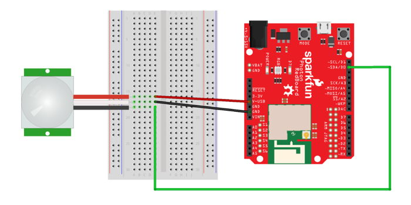

# Motion Sensor

The motion sensor included in your Photon kit uses passive infrared \(PIR\) light to detect movement in the surrounding environment up to about 10 feet away.


## How to Connect Motion Sensor

The motion sensor has a 3-wire JST connector with 3 pins for plugging into a breadboard. \(If the end of your wire connector doesn't have 3 pins, attach the [JST right angle connector](https://www.sparkfun.com/products/9750) included in your kit.\)

To connect a motion sensor to your Photon using the breadboard, you will need:

* Motion sensor \(with 3-pin JST right angle connector\)
* 3 jumper wires \(use different colors to help identify them; it may help to match the sensor wires\)

| Motion Sensor | Photon Pin |
| :--- | :--- |
| Black - Data | any I/O pin |
| White - Ground | GND |
| Red - Power \(5-12V\) | 5V through VIN or V-USB |

Here are the steps to connect the motion sensor to your Photon using the breadboard:

1. Insert the 3 pins of the motion sensor connector into **different** terminal strip rows on the breadboard. \(Different terminal strip rows have different row numbers.\)
2. Plug one end of a **jumper wire** into the **same** terminal strip row as the **sensor's black wire**. Plug the other end of this jumper wire into an I/O pin on the Photon circuit board.
3. Plug one end of a **second jumper wire** into the **same** terminal strip row as the **sensor's white wire**. Plug the other end of this jumper wire into a pin hole connected to GND:  either plug it into a negative power rail \(which is connected to GND via a different jumper wire\), or plug it directly into a GND pin on the Photon circuit board.
4. Plug one end of a **third jumper wire** into the **same** terminal strip row as the **sensor's red wire**. Plug the other end of this jumper wire into either the VIN pin or V-USB pin on the Photon circuit board. If your Photon is being powered through the barrel jack, use the VIN pin. Otherwise, if your Photon is being powered through the Micro-USB port, use the V-USB pin.

Here's a wiring diagram showing a possible way to connect a motion sensor:



Keep in mind that your connection can look different than this example diagram:

* Your motion sensor pins could be inserted into **different row numbers** on either breadboard side. \(The example connects the sensor pins to rows 16-18 on the left side of the breadboard\).
* Your motion sensor pins could be inserted into a **different column** of the breadboard. \(The example connects the sensor pins into column A of the terminal strip rows\).
* Your sensor's black wire could connect \(through a jumper wire\) to a **different I/O pin**. \(The example connects to the D0 pin on the Photon circuit board\).
* Your sensor's white wire could connect \(through a jumper wire\) to **either a negative power rail or a different GND pin**. \(There are three available GND pins on the Photon circuit board.\)
* Your sensor's red wire could connect \(through a jumper wire\) to **either the VIN pin or V-USB pin**. \(The example connects to the V-USB pin on the Photon circuit board\).

## How to Code Motion Sensor

The basic steps to use a motion sensor in your app code are:

1. Declare a global variable to store the I/O pin number for the motion sensor.
2. Set the pin mode for the motion sensor pin in the `setup()` function.
3. Use a `digitalRead()` statement to check whether the sensor detects any motion, and add code statements that should be performed if motion is detected \(or not detected\).

### Global Variable {#global-variable}

You should declare a global variable to store the I/O pin number that the motion sensor's data wire is connected to. This will make it easier to understand your code \(and easier to modify the code if you were to connect the motion sensor to a different pin number\).

Add this code statement \(modify if necessary\) **before** the `setup()` function:

```cpp
int motion = D0;
```

This line of code does 3 things \(in order\):

1. **It declares a data type for the variable's value.** In this case, `int` stands for integer \(whole number\). Photon pin numbers are always treated as `int` values \(even though they have letters\).
2. **It declares the variable's name.** In this example, the variable will be called `motion`. You can change the variable name, but choose a name that will make sense to anyone reading the code.
3. **It assigns a value to the variable.** In this example, the variable's value will be equal to `D0`. If necessary, modify this value to match the actual I/O pin number that your button is connected to.

#### MULTIPLE SENSORS {#multiple-led-lights}

If you have **multiple** motion sensors connected to your Photon, then be sure to give each sensor a unique variable name by adding an adjective or number to the variable names. For example:

```cpp
int motion1 = D0;
int motion2 = D1;
```

### Set Pin Mode {#set-pin-mode}

You need to set the pin mode for the motion sensor to be used as an input.

Add this code statement \(modify if necessary\) **within** the `setup()` function:

```cpp
pinMode(motion, INPUT_PULLUP);
```

The `pinMode()` method requires two parameters inside its parentheses \(in this order\):

1. **The I/O pin number**, which can be the actual pin number \(such as: `D0`, etc.\) or a variable that stores a pin number. In this example, a variable named `motion` is listed. If necessary, change this to match the variable name for your button.
2. **The mode value**, which will always be `INPUT_PULLUP` for a motion sensor.

#### MULTIPLE SENSORS {#multiple-led-lights-1}

If you have **multiple** motion sensors connected to your Photon, then be sure to set the pin mode for each sensor's pin variable. For example:

```cpp
pinMode(motion1, INPUT_PULLUP);
pinMode(motion2, INPUT_PULLUP);
```

### Check If Motion Detected

You can use the `digitalRead()` method to check whether the sensor detects any motion.

Add this code \(modify as necessary\) to your app within the `loop()` function or a custom function:

```cpp
int motionState = digitalRead(motion);

if(motionState == LOW) {
​    // add code to do something if motion detected
​
    delay(2000); // wait 2 seconds before checking sensor again
}
```

In the first code statement, a local variable named `motionState` is declared that will have a data type of `int` \(integer\).  This variable is made equal to whatever value is returned by the `digitalRead()` method.  You can change the name of this variable, but it will make sense if it's similar to the variable name used for the motion sensor pin number.

The `digitalRead()` method requires one parameter insides its parentheses: 

1. **The I/O pin number**, which can be the actual pin number \(such as: `D0`, etc.\) or a variable that stores a pin number. In this example, a variable named `motion` is listed. If necessary, change this to match the variable name for your motion sensor's pin number.

The `digitalRead()` method will return a value of either `HIGH` or `LOW` \(which are treated as if they were `int` values\):

* `HIGH` indicates that motion is **NOT** detected.
* `LOW` indicates that motion is detected.

The condition listed inside the parentheses of the [if statement](http://www.wiring.org.co/reference/if_.html) checks whether the value of `motionState` is [equivalent](http://www.wiring.org.co/reference/equality.html) to `LOW`:

* If this condition is **true**, the code within the curly braces of the `if` statement will be performed. You will need to add code statements within the curly braces that perform the actions you want. 
* If this condition is **false** \(because the `motionState` is `HIGH`\), the code within the curly braces will **NOT** be performed. Optionally, you can add an [else statement](http://www.wiring.org.co/reference/else.html) to perform a different set of code statements when motion is **not** detected.

**IMPORTANT:**  You will notice that a `delay()` of 2 seconds is included if motion is detected. This delay is needed to allow the motion sensor to capture a new "snapshot" of the environment before checking the sensor again.


