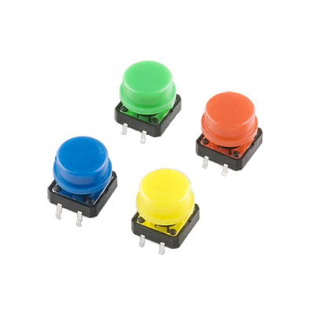
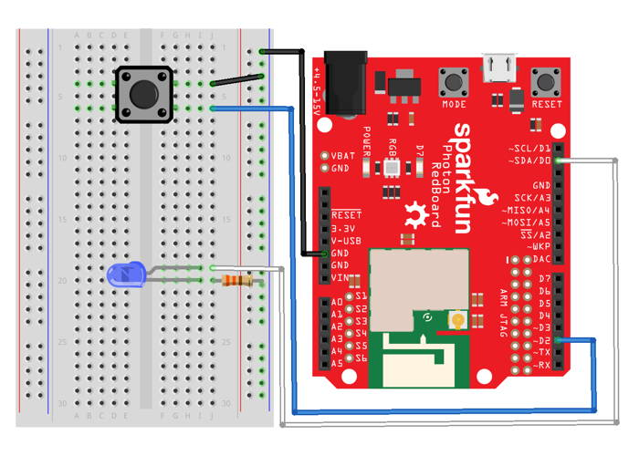

# Push Buttons

Physical buttons that people can push are used as inputs on many different types of devices.

Your Photon kit has a set of 4 push buttons with different cap colors: red, yellow, green, and blue.



The buttons in your Photon kit are classified as **momentary switches**, which means they detect when they are being pressed or pushed. For example, the keys on a computer keyboard are momentary switches:  they are only "on" when you press them \(and they turn "off" when you release them\).

This is different from **maintained switches**, which physically toggle between one state and another state. For example, a light switch is a maintained switch:  pressing \(or flipping\) the switch will turn it on, and it will stay this way until pressed again \(or flipped back\).

However, you can make a push button **act like a maintained switch** by adding a global variable in your app code to track the button's current status \("on" or "off"\), and then toggling this status in your code each time the button is pushed.

## How to Connect Button

Each push button has 2 pairs of metal legs on opposite sides of its base. Unlike other components that connect to only one half of a breadboard, the push button has to connect to **both** halves of the breadboard across the gap in the middle. This is simply due to the width of the button – there isn't enough space to connect the push button plus jumper wires on one half of the breadboard.

To connect a push button to your Photon using the breadboard, you will need:

* Push button
* 2 jumper wires \(use different colors to help identify them\)

| Push Button | Photon Pin |
| :--- | :--- |
| Any Leg | any I/O pin |
| Adjacent Leg on same side | GND |

Here are the steps to connect the push button to your Photon using the breadboard:

1. Place the push button along the middle divider of the breadboard, so one pair of legs will align with **pin holes in column D** on the left half of the breadboard, while the other pair of legs \(on the opposite side\) will align with **pin holes in column G** on the right half of the breadboard. If necessary, you can gently bend the metal legs to align them better with the pin holes.
2. Firmly press the button down to "snap" its base into place, so it's flat against the breadboard.
3. Plug one end of a **jumper wire** into the **same** terminal strip row as **one of the button legs** on the right half of the breadboard. Plug the other end of this jumper wire into an I/O pin on the Photon circuit board.
4. Plug one end of the **other jumper wire** into the **same** terminal strip row as the **other button leg** on the right half of the breadboard. Plug the other end of this jumper wire into a pin hole connected to GND:  either plug it into a negative power rail \(which is connected to GND via a different jumper wire\), or plug it directly into a GND pin on the Photon circuit board.

Here's a wiring diagram showing a possible way to connect a push button \(you can ignore the wiring for the LED and resistor\):



Keep in mind that your connection can look different than this example diagram:

* Your button legs could be inserted into **different row numbers** on the breadboard. \(The example connects the button legs to row 4 and row 6\).
* Your button leg could connect to a **different I/O pin**. \(The example connects to the D2 pin on the Photon circuit board\).
* The negative power rail on your breadboard could connect to a **different GND pin**. \(There are three available GND pins on the Photon circuit board\). Alternatively, your button could be connected directly to a GND pin instead of through a negative power rail.

## How to Code Button

The basic steps to use a push button in your app code are:

1. Declare a global variable to store the I/O pin number for the button.
2. Set the pin mode for the button pin in the `setup()` function.
3. Use a `digitalRead()` statement to check whether the button is currently pressed, and add code statements that should be performed if the button is pressed \(or not pressed\).

### Global Variable {#global-variable}

You should declare a global variable to store the I/O pin number that the button is connected to. This will make it easier to understand your code \(and easier to modify the code if you were to connect the button to a different pin number\).

Add this code statement \(modify if necessary\) **before** the `setup()` function:

```cpp
int button = D2;
```

This line of code does 3 things \(in order\):

1. **It declares a data type for the variable's value.** In this case, `int` stands for integer \(whole number\). Photon pin numbers are always treated as `int` values \(even though they have letters\).
2. **It declares the variable's name.** In this example, the variable will be called `button`. You can change the variable name, but choose a name that will make sense to anyone reading the code.
3. **It assigns a value to the variable.** In this example, the variable's value will be equal to `D2`. If necessary, modify this value to match the actual I/O pin number that your button is connected to.

#### MULTIPLE BUTTONS {#multiple-led-lights}

If you have **multiple** buttons connected to your Photon, then be sure to give each button a unique variable name by adding an adjective or number to the variable names. For example:

```cpp
int button1 = D2;
int button2 = D3;
```

### Set Pin Mode {#set-pin-mode}

You need to set the pin mode for the button to be used as an input.

Add this code statement \(modify if necessary\) **within** the `setup()` function:

```cpp
pinMode(button, INPUT_PULLUP);
```

The `pinMode()` method requires two parameters inside its parentheses \(in this order\):

1. **The I/O pin number**, which can be the actual pin number \(such as: `D2`, etc.\) or a variable that stores a pin number. In this example, a variable named `button` is listed. If necessary, change this to match the variable name for your button.
2. **The mode value**, which will always be `INPUT_PULLUP` for a push button.

#### MULTIPLE BUTTONS {#multiple-led-lights-1}

If you have **multiple** buttons connected to your Photon, then be sure to set the pin mode for each button pin variable. For example:

```cpp
pinMode(button1, INPUT_PULLUP);
pinMode(button2, INPUT_PULLUP);
```

### Check If Button Pressed

The `digitalRead()` method is used to check whether a button is currently pressed.

Add this code \(modify as necessary\) to your app within the `loop()` function or a custom function:

```cpp
int buttonState = digitalRead(button);

if(buttonState == LOW) {
​    // add code to do something if button pressed
​
}
```

In the first code statement, a local variable named `buttonState` is declared that will have a data type of `int` \(integer\).  This variable is made equal to whatever value is returned by the `digitalRead()` method.  You can change the name of this variable, but it will make sense if it's similar to the variable name used for the button pin number.

The `digitalRead()` method requires one parameter insides its parentheses: 

1. **The I/O pin number**, which can be the actual pin number \(such as: `D2`, etc.\) or a variable that stores a pin number. In this example, the variable named `button` is listed. If necessary, change this to match the variable name for your button's pin number.

The `digitalRead()` method will return a value of either `HIGH` or `LOW` \(which are treated as if they were `int` values\):

* `HIGH` indicates that the button is **NOT** currently pressed.
* `LOW` indicates that the button is currently pressed.

The condition listed inside the parentheses of the [if statement](http://www.wiring.org.co/reference/if_.html) checks whether the value of `buttonState` is [equivalent](http://www.wiring.org.co/reference/equality.html) to `LOW`:

* If this condition is **true**, the code within the curly braces of the `if` statement will be performed. You will need to add code statements within the curly braces that perform the actions you want. 
* If this condition is **false** \(because the `buttonState` is `HIGH`\), the code within the curly braces will **NOT** be performed. Optionally, you can add an [else statement](http://www.wiring.org.co/reference/else.html) to perform a different set of code statements when the button is **not** pressed.


