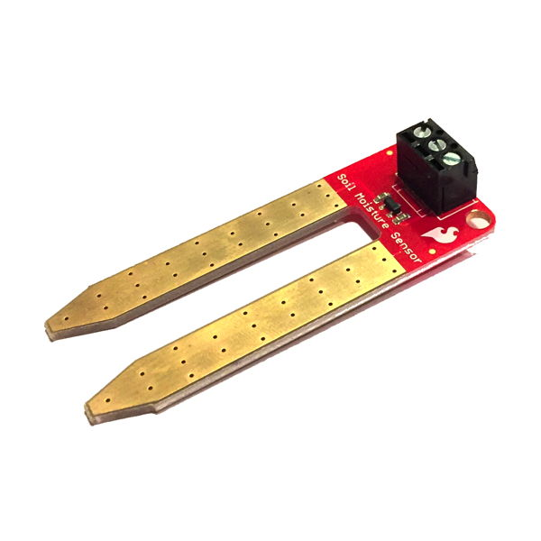

# Soil Moisture Sensor

The soil moisture sensor in your Photon kit can be inserted into soil or similar materials \(sand, etc.\) to measure the amount of moisture in the material.

## How to Connect Moisture Sensor

The moisture sensor is a variable resistor with two gold-plated legs that are inserted into soil. Moisture in the soil will conduct electricity from one sensor leg to the other. The amount of electricity conducted  depends on the amount of soil moisture.

### Attach Wires to Sensor

The soil moisture sensor in your Photo kit has a 3-pin screw terminal. You'll need to attach 3 jumper wires to the screw terminal. The back of the sensor has labels for the 3 pins:  SIG, GND, VCC.

To attach jumper wires to the soil moisture sensor, you will need:

* Soil moisture sensor with 3-pin screw terminal
* 3 jumper wires \(use different colors to help identify them; **recommend red, black, and yellow**\)
* Small flat-head screwdriver \(obtain from teacher, if necessary\)

1. Use a small flat-head screwdriver to turn each screw counterclockwise until slightly loosened \(but don't remove them\). This creates openings on the top of the terminal to insert the jumper wires.
2. Insert one end of the **first jumper wire \(yellow\)** into the terminal slot for **SIG**. Then use the screwdriver tighten that terminal's screw \(turn clockwise\) until the jumper wire is held firmly.
3. Insert one end of the **second jumper wire \(black\)** into the terminal slot for **GND**. Then use the screwdriver tighten that terminal's screw \(turn clockwise\) until the jumper wire is held firmly.
4. Insert one end of the **third jumper wire \(red\)** into the terminal slot for **VCC**. Then use the screwdriver tighten that terminal's screw \(turn clockwise\) until the jumper wire is held firmly.

### Connect to Breadboard

To connect a soil moisture sensor to your Photon using the breadboard, you will need:

* Soil Moisture Sensor with 3 attached jumper wires

| Soil Moisture Sensor | Photon Pin |
| :--- | :--- |
| SIG \(Signal\) – Yellow | any analog I/O pin \(A0, A1, A2, A3, A4, A5\) |
| GND \(Ground\) – Black | GND |
| VCC \(Power\) – Red | any I/O pin |


**TWIN PINS:** Analog pins A2, A3, A4, and A5 are each represented by **two** pins on the Photon board. The duplicate pins are labeled as: SS/A2, SCK/A3, MISO/A4, MOSI/A5. If you use one of these pins, you **cannot** use its twin at the same time.


Here are the steps to connect the soil moisture sensor to your Photon using the breadboard:

1. Plug the **SIG jumper wire** into any analog I/O pin on the Photon circuit board.
2. Plug the **GND jumper wire** into a pin hole connected to GND:  either plug it into a negative power rail on the breadboard \(which is connected to GND via a different jumper wire\), or plug it directly into a GND pin on the Photon circuit board.
3. Plug the **VCC jumper wire** into any I/O pin on the Photon circuit board.

Here's a wiring diagram showing a possible way to connect a soil moisture sensor:

Keep in mind that your connection can look different than this example diagram:

* Your moisture sensor's SIG wire could connect to a **different analog I/O pin**. \(The example connects to the A2 pin on the Photon circuit board.\)
* Your moisture sensor's GND wire could connect **either to a different GND pin or to a negative power rail connected to a GND pin**. \(There are three available GND pins on the Photon circuit board.\)
* Your moisture sensor's VCC wire could connect to a **different I/O pin**. \(The example connects to the D6 pin on the Photon circuit board.\)
* Alternatively, you could connect the sensor's wires into different terminal strip rows on a breadboard, and then use additional jumper wires to connect to the Photon circuit board.

### Insert into Soil

Once the moisture sensor is connected to the Photon, insert the sensor legs into the soil \(or similar material\) where you need to take measurements.

## How to Code Moisture Sensor

explain

