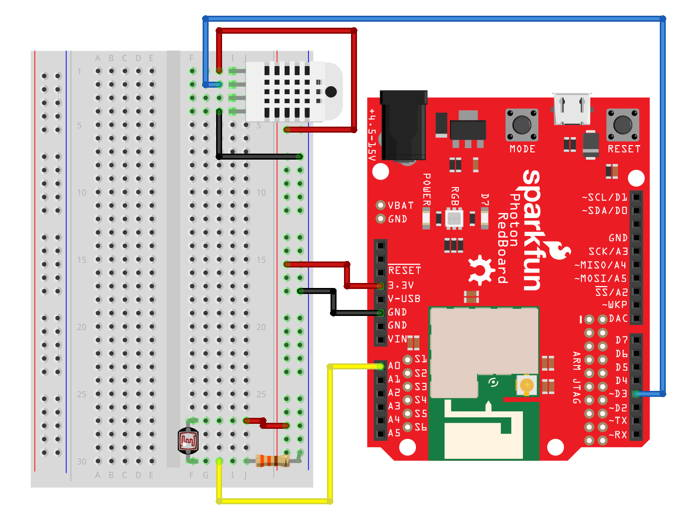

# Temperature Sensor

The RHT03 sensor in your Photon kit can measure the relative humidity and temperature of the air.


## How to Connect RHT03 Sensor

To connect the RHT03 sensor to your Photon using the breadboard, you will need:

* RHT03 Humidity and Temperature Sensor
* 3 jumper wires \(use different colors to help identify them\)

The RHT03 humidity and temperature sensor has 4 metal legs. The front side of the sensor has openings to allow air in.

If you were looking at the front of the sensor and the sensor legs were numbered **left to right** as 1-4, the wiring connections would be:

| RHT03 Temperature Sensor | Photon Pin |
| :--- | :--- |
| Leg 1 – Power \(3.3-6V\) | 3.3V or 5V \(through VIN or V-USB\) |
| Leg 2 – Data | any I/O pin |
| Leg 3 – Unused | \(none\) |
| Leg 4 – Ground | GND |


**3.3V OR 5V:**  The RHT03 sensor can operate on either 3.3V or 5V of power.

* If your Photon is being powered through the **barrel jack**, you can connect the RHT03 sensor to either the **3.3V pin or VIN pin**.
* If your Photon is being powered through the **Micro-USB** port, you can connect the RHT03 sensor to either the **3.3V pin or V-USB pin**.


Here are the steps to connect the RHT03 sensor to your Photon using the breadboard:

1. Insert the four metal legs of the sensor into **different** terminal strip rows on the breadboard. \(Different terminal strip rows have different row numbers.\)
2. Plug one end of a **jumper wire** into the **same** terminal strip row as the **power leg** of the sensor. Plug the other end of this jumper wire into the 3.3V pin or a 5V pin \(VIN or V-USB\) on the Photon circuit board \(or to a **positive** power rail on the breadboard connected to 3.3V, VIN, or V-USB\). If your Photon is being powered through the **barrel jack**, connect to either the **3.3V pin or VIN pin**. Otherwise, if your Photon is being powered through the **Micro-USB** port, connect to either the **3.3V pin or V-USB pin**.
3. Plug one end of a **second jumper wire** into the same terminal strip row as the **data leg** of the sensor. Plug the other end of this jumper wire into any I/O pin on the Photon circuit board. 
4. Plug one end of the **third jumper wire** into the **same** terminal strip row as the **ground leg** of the sensor. Plug the other end of this jumper wire into a pin hole connected to GND:  either plug it into a negative power rail \(which is connected to GND via a different jumper wire\), or plug it directly into a GND pin on the Photon circuit board.

Here's a wiring diagram showing a possible way to connect the RHT03 humidity and temperature sensor \(ignore the wiring for the light sensor\):



Keep in mind that your connection can look different than this example diagram:

* Your RHT03 sensor legs could be inserted into **different row numbers**. \(The example connects the RHT03 sensor legs to rows 1-4 on the right side of the breadboard\).
* Your RHT03 sensor legs could be inserted into a **different column** of the breadboard. \(The example connects the RHT03 sensor legs into column H of the terminal strip rows\).
* Your RHT03 sensor could connect \(through a jumper wire\) to a **different I/O pin**. \(The example connects the RHT03 sensor to the D3 pin.\)
* Your RHT03 sensor could connect \(through a jumper wire\) **directly to the 3.3V pin or a 5V pin \(VIN or V-USB\) – or it could connect to a positive power rail on the breadboard that's connected to the 3.3V pin or a 5V pin**.
* Your RHT03 sensor could connect \(through a jumper wire\) **either directly to a GND pin or to a negative power rail that's connect to a GND pin**. \(There are three available GND pins.\)

## How to Code RHT03 Sensor

The basic steps to control the RHT03 humidity and temperature sensor in your app code are:

1. Include the SparkFun RHT03 library in your app.
2. Declare a global variable to store the I/O pin number for the RHT03 sensor.
3. Create a `RHT03` object assigned to a global variable called `rht`.
4. Use the `rht.begin()` method to start the RHT03 sensor in the `setup()` function.
5. Use a sequence of `rht.update()`, `rht.humidity()`, and `rht.tempF()` statements to get new humidity and temperature readings.

### Include Library

Your Photon app must include a code library that will allow you to control the RHT03 sensor.


1. In Particle Build, click on the Libraries icon to open the Libraries menu panel.
2. Type `rht` into the search field. Select the result called: **SparkFunRHT03**
3. Click the button to "Include in Project"
4. Select the title of your Photon app, and then click the "Confirm" button

Particle Build will **automatically** insert this `#include` statement at the beginning of your app code:

```cpp
// This #include statement was automatically added by the Particle IDE.
#include <SparkFunRHT03.h>
```

### Global Variables {#global-variable}

You should declare a global variable to store the I/O pin number that the RHT03 sensor's data leg is connected to. This will make it easier to understand your code \(and easier to modify the code if you were to connect the motion sensor to a different pin number\).

You will also need to create an object using the `RHT03` class in the included library, and assign this object to a global variable.

Add this code statement \(modify if necessary\) **before** the `setup()` function:

```cpp
int rhtData = D3;
RHT03 rht;
```

The **first line of code** does 3 things \(in order\):

1. **It declares a data type for the variable's value.** In this case, `int` stands for integer \(whole number\). Photon pin numbers are always treated as `int` values \(even though they have letters\).
2. **It declares the variable's name.** In this example, the variable will be called `rhtData`. You can change the variable name, but choose a name that will make sense to anyone reading the code.
3. **It assigns a value to the variable.** In this example, the variable's value will be equal to `D3`. If necessary, modify this value to match the actual I/O pin number that your sensor is connected to.

The **second line of code** creates a new object using the `RHT03` class, and assigns the object to a global variable named `rht`. 

### Start Sensor in Setup

The `rht.begin()` method is used to start the RHT03 sensor, which will automatically set its pin mode.

Add this code statement within the `setup()` function to start the RHT03 sensor:

```cpp
rht.begin(rhtData);
```

The `rht.begin()` method requires the sensor's I/O pin number. In this case, the global variable named `rhtData` stores this value. If you used a different name for the global variable storing your RHT03 sensor pin number, then insert that name instead.

### Get Sensor Readings

The `rht.update()` method is used to get new sensor readings for the relative humidity and temperature of the air.

If the update is successful, the `rht.update()` method will return a value of `1` \(which is equivalent to`true`\). Then you can use other `rht` methods to get the updated values for the relative humidity \(%\) and temperature \(in Fahrenheit or Celsius\).

* The `rht.humidity()` method returns the relative humidity of the air as a value between 0-100 representing a percentage. A higher number means the air is more humid \(has more water vapor\).
* The `rht.tempF()` method returns the temperature of the air in degrees Fahrenheit.
* The `rht.tempC()` method returns the temperature of the air in degrees Celsius.

Each humidity and temperature measurement is returned as a `float` value \(decimal number\).

