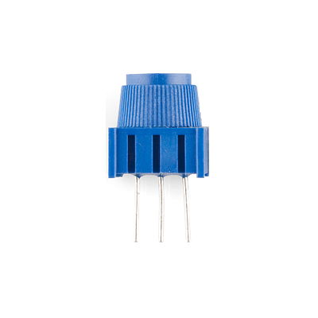
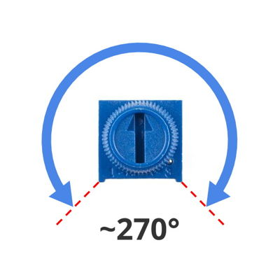
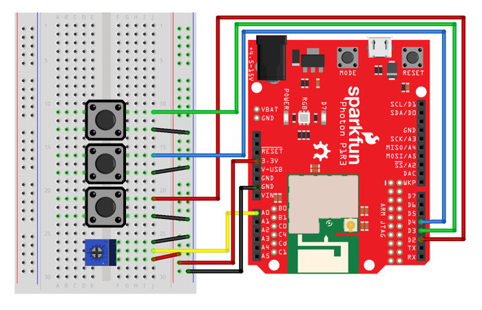

# Trimpot Dial

Your Photon kit includes a "trimpot" \(trimmable potentiometer\) that can be rotated and used as a dial. A potentiometer is a variable resistor that can be adjusted by sliding, rotating, or another type of physical interaction. Potentiometers are used in various devices such as: joysticks and game controllers, control knobs and sliders, dimmer switches for lights, volume knobs for stereos, etc.



The trimpot dial can be rotated clockwise or counterclockwise approximately 270° \(it does **NOT** rotate all the way around\). The position of the dial can be measured and used as an input for a value that has a range from minimum to maximum.



## How to Connect Trimpot

The trimpot dial has 3 metal legs that will be inserted into pin holes on the breadboard.

To connect a trimpot dial to your Photon using the breadboard, you will need:

* Trimpot
* 3 jumper wires \(use different colors to help identify them\)

| Trimpot | Photon Pin |
| :--- | :--- |
| Outer Leg \(pick one\) | 3.3V |
| Middle Leg | any analog I/O pin \(A0, A1, A2, A3, A4, A5\) |
| Other Outer Leg | GND |


**3.3V MAXIMUM:**  Analog inputs, such as the trimpot, require 3.3V of power for accurate measurements. Connect the trimpot to the 3.3V pin on your Photon, or connect it to a positive power rail that's connected to the 3.3V pin.


Here are the steps to connect the trimpot to your Photon using the breadboard:

1. Insert the three metal legs of the trimpot into **different** terminal strip rows on the breadboard. \(Different terminal strip rows have different row numbers.\)
2. Plug one end of a **jumper wire** into the **same** terminal strip row as an **outer leg** of the trimpot. Plug the other end of this jumper wire into the 3.3V pin on the Photon circuit board \(or plug it into a positive power rail that's connected to the 3.3V pin via a different jumper wire\).
3. Plug one end of a **second jumper wire** into the same terminal strip row as the **middle leg** of the trimpot. Plug the other end of this jumper wire into any analog I/O pin on the Photon circuit board. 
4. Plug one end of the **third jumper wire** into the **same** terminal strip row as the **other outer leg** of the trimpot. Plug the other end of this jumper wire into a pin hole connected to GND:  either plug it into a negative power rail \(which is connected to GND via a different jumper wire\), or plug it directly into a GND pin on the Photon circuit board.

Here's a wiring diagram showing a possible way to connect a trimpot \(ignore the wiring for the three push buttons\):



Keep in mind that your connection can look different than this example diagram:

* Your trimpot legs could be inserted into **different row numbers** on either breadboard side. \(The example connects the trimpot legs to rows 26-28 on the right side of the breadboard\).
* Your trimpot legs could be inserted into a **different column** of the breadboard. \(The example connects the trimpot legs into column F of the terminal strip rows\).
* Your trimpot could connect \(through a jumper wire\) to a different analog I/O pin on the Photon circuit board. \(The example connects the trimpot to the A0 pin.\)
* Your trimpot could connect \(through a jumper wire\) **either directly to the 3.3V pin** **or to a positive power rail on the breadboard that's connected to the 3.3V pin.**
* Your trimpot could connect \(through a jumper wire\) **either directly to a GND pin or to a negative power rail that's connect to a GND pin**. \(There are three available GND pins on the Photon circuit board.\)

## How to Code Trimpot

The basic steps to control a trimpot dial in your app code are:

1. Declare a global variable to store the I/O pin number for the trimpot.
2. Use the `analogRead()` method to measure the trimpot dial position.
3. **OPTIONAL:**  Use the `map()` method to convert the trimpot reading to a custom range.

### Global Variable

You should declare a global variable to store the I/O pin number that the trimpot is connected to. This will make it easier to understand your code \(and easier to modify the code if you were to connect the trimpot to a different pin number\).

Add this code statement \(modify if necessary\) **before** the `setup()` function:

```cpp
int trimpot = A0;
```

This line of code does 3 things \(in order\):

1. **It declares a data type for the variable's value.**  In this case, `int` stands for integer \(whole number\). Photon pin numbers are always treated as `int` values \(even though they have letters\).
2. **It declares the variable's name.** In this example, the variable will be called `trimpot`. You can change the variable name, but choose a name that will make sense to anyone reading the code.
3. **It assigns a value to the variable.**  In this example, the variable's value will be equal to `A0`. If necessary, modify this value to match the actual I/O pin that your speaker is connected to.


**PIN MODE:**  Analog inputs do **NOT** need to have their pin mode set within the `setup()` function. Their pin mode gets automatically set when the `analogRead()` method is used.


### Read Trimpot

The `analogRead()` method is used to read the trimpot, which indicates the trimpot dial position.

Add this code \(modify as necessary\) to your app within the `loop()` function or a custom function:

```cpp
int trimpotRead = analogRead(trimpot);
// add code to do something with trimpotRead
```

A local variable named `trimpotRead` is declared that will have a data type of `int` \(integer\).  This variable is made equal to whatever value is returned by the `analogRead()` method.  You can change the name of this variable, but it will make sense if it's similar to the variable name used for the trimpot pin number.

The `analogRead()` method requires one parameter insides its parentheses: 

1. **The I/O pin number**, which can be the actual pin number \(such as: `A0`, etc.\) or a variable that stores a pin number. In this example, the variable named `trimpot` is listed. If necessary, change this to match the variable name for your trimpot's pin number.

The `analogRead()` method will return an integer \(whole number\) value ranging from 0-4095:

* If the dial is rotated all the way to the left \(counterclockwise\), the value will be 0.
* If the dial is rotated all the way to the right \(clockwise\), the value will be 4095.
* If the dial is rotated somewhere in-between, the value will be proportional to the dial's position. For example, if the dial is rotated exactly halfway, the value will be 2048.

You'll need to add code to do something with the reading stored as `trimpotRead`. For example, this might be an if-else statement to perform certain actions based on whether `trimpotRead` is greater than \(or less than\) one or more specific values.

### Map Value to Custom Range {#mapping-dial-position-to-custom-range-of-values}

In many cases, it may not be convenient to work with a value that ranges from 0-4095. Instead, it might be easier to have a value within a smaller custom range \(such as:  0-10, 0-100, etc.\) that makes more sense for your particular task.

The `map()` function can be used to convert a value from its original range \(such as 0-4095\) into a new range of your choice. You decide the minimum and maximum values for the new range.

For example, if a trimpot dial were being used to control the brightness of an LED light, you might want the trimpot to return a value between 0-255 because the `analogWrite()` method used to set the brightness of an LED requires a value in this range.

Add this code \(modify as necessary\) to your app within the `loop()` function or a custom function:

```cpp
int trimpotRead = analogRead(trimpot);
int minValue = 0;
int maxValue = 100;
int trimpotValue = round(map(trimpotRead, 0, 4095, minValue, maxValue + 1));
// add code to do something with trimpotValue
```

As necessary, change the values assigned to `minValue` and `maxValue` to whatever numbers you want to use for your custom range. Also, the `minValue` **doesn't** have to be zero.

Be sure to add code to do something with `trimpotValue`. For example, this might be an if-else statement to perform certain actions based on whether `trimpotValue` is greater than \(or less than\) one or more specific values.

**NOTE:** The code uses the `round()` method to round the mapped value to the nearest integer because the `map()` method returns a `float` \(decimal value\). Also, inside the `map()` method, the code intentionally adds 1 to the `maxValue` because otherwise it is very difficult to get the maximum value even if the trimpot dial is turned clockwise all the way.

