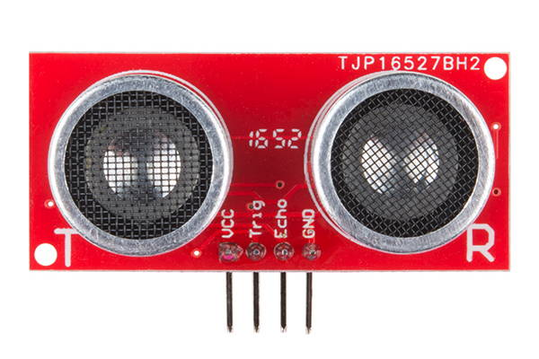
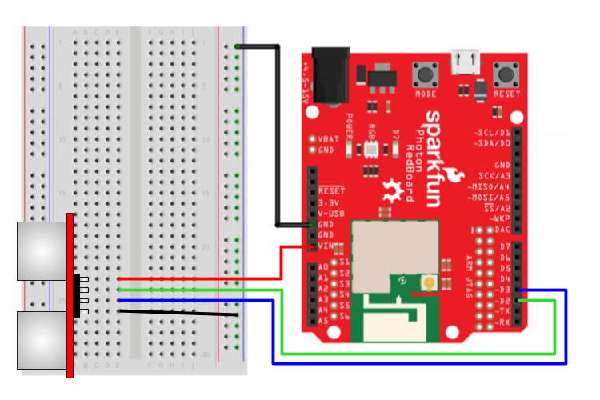

# Ultrasonic Sensor \*


**ADD-ON COMPONENT:**  The SparkFun Photon Kit does **NOT** include an ultrasonic sensor as a standard component. However, SparkFun sells the [HC-SR04 Ultrasonic Sensor](https://www.sparkfun.com/products/13959), which can be easily connected to a Photon. Your teacher may have added this sensor to your kit. 


An ultrasonic sensor uses sonar to measure the distance to an object, similar to how bats and dolphins use [echolocation](https://en.wikipedia.org/wiki/Animal_echolocation) for navigation and hunting.



An ultrasonic sensor has a transmitter \(i.e., speaker\) that produces high-frequency sound \(beyond the range of human hearing\). The sensor also has a matching receiver \(i.e., microphone\) that detects the echo of the high-frequency sound when it reflects back from an object. By measuring how much time it takes for the echo to arrive, you can calculate the distance between the sensor and the object.

The HC-SR04 ultrasonic sensor measures distances in a narrow cone of about 15° directly in front of the sensor. This sensor can detect obstacles located up to 400 cm away \(about 13 feet\). The sensor measurements are very accurate, within about 3 mm \(about 0.1 inch\) of the actual distance.

## How to Connect Sensor

The HC-SR04 ultrasonic sensor has 4 pins for plugging into a breadboard. Each pin is labeled on the sensor's circuit board.

To connect the ultrasonic sensor to your Photon using the breadboard, you will need:

* Ultrasonic Sensor \(HC-SR04\)
* 4 jumper wires \(use different colors to help identify them\)

| Ultrasonic Sensor | Photon Pin |
| :--- | :--- |
| VCC | 5V through VIN or V-USB |
| Trig | any I/O pin |
| Echo | any I/O pin |
| GND | GND |


**5V REQUIRED:** The ultrasonic sensor requires 5V of power to operate.

* If your Photon is being powered through the **barrel jack**, connect to the **VIN** pin.
* If your Photon is being powered through the **Micro-USB** port, connect to the **V-USB** pin.


Here are the steps to connect the ultrasonic sensor to your Photon using the breadboard:

1. Insert the 4 pins of the ultrasonic sensor into **different** terminal strip rows on the breadboard. \(Different terminal strip rows have different row numbers.\) It is recommended to insert the sensor on the left half of the breadboard with the transmitter and receiver **facing away from the Photon**.
2. Plug one end of a **jumper wire** into the **same** terminal strip row as the **sensor's VCC pin**. Plug the other end of this jumper wire into either the VIN pin or V-USB pin on the Photon circuit board \(or to a **positive** power rail on the breadboard that is connected to VIN or V-USB\). If your Photon is being powered through the barrel jack, connect to the VIN pin. Otherwise, if your Photon is being powered through the Micro-USB port, connect to the V-USB pin.
3. Plug one end of a **second jumper wire** into the **same** terminal strip row as the **sensor's Trig pin**. Plug the other end of this jumper wire into an I/O pin on the Photon circuit board.
4. Plug one end of a **third jumper wire** into the **same** terminal strip row as the **sensor's Echo pin**. Plug the other end of this jumper wire into an I/O pin on the Photon circuit board.
5. Plug one end of a **fourth jumper wire** into the **same** terminal strip row as the **sensor's GND pin**. Plug the other end of this jumper wire into a pin hole connected to GND:  either plug it into a negative power rail \(which is connected to GND via a different jumper wire\), or plug it directly into a GND pin on the Photon circuit board.

Here's a wiring diagram showing a possible way to connect the ultrasonic sensor:



Keep in mind that your connection can look different than this example diagram:

* Your ultrasonic sensor pins could be inserted into **different row numbers**. \(The example connects the sensor pins to rows 23-26 on the left side of the breadboard.\)
* Your motion sensor pins could be inserted into a **different column** of the breadboard. \(The example connects the sensor pins into column B of the terminal strip rows.\)
* Your sensor's VCC pin could connect \(through a jumper wire\) to **either the VIN pin or V-USB pin \(or to a positive power rail that's connected to one of these pins\).** \(The example connects directly to the VIN pin.\)
* Your sensor's Trig pin could connect \(through a jumper wire\) to a **different I/O pin**. \(The example connects to the D2 pin.\)
* Your sensor's Echo pin could connect \(through a jumper wire\) to a **different I/O pin**. \(The example connects to the D3 pin.\)
* Your sensor's GND pin could connect \(through a jumper wire\) to **either to a GND pin or to a negative power rail connected to a GND pin**. \(There are three available GND pins.\)

## How to Code Sensor

The basic steps to use an ultrasonic sensor in your app code are:

1. Declare global variables to store the I/O pin numbers for the ultrasonic sensor.
2. Set the pin modes for the sensor in the `setup()` function, and turn off the transmitter.
3. Use a custom function that will measure and return the distance to the nearest object.

### Global Variables

You should declare global variables to store the I/O pin numbers that the ultrasonic sensor's transmitter \(Trig\) and receiver \(Echo\) are connected to. This will make it easier to understand your code \(and easier to modify the code if you were to connect the trimpot to a different pin number\).

Add this code \(modify if necessary\) **before** the `setup()` function:

```cpp
int TRIG_PIN = D2;
int ECHO_PIN = D3;
```

Each line of code does 3 things \(in order\):

1. **It declares a data type for the variable's value.**  In this case, `int` stands for integer \(whole number\). Photon pin numbers are always treated as `int` values \(even though they have letters\).
2. **It declares the variable's name.** In this example, the variables will be called `TRIG_PIN` \(transmitter\) and `ECHO_PIN` \(receiver\). You can change the variable names, but choose names that will make sense to anyone reading the code. You will need to make sure the same variable names are listed in the custom function which measures the distance to the nearest object.
3. **It assigns a value to the variable.**  In this example, the variables will be equal to `D2` and `D3`. If necessary, modify these values to match the I/O pins that your sensor pins are connected to.

### Set Pin Modes & Turn Off

You need to set the pin modes for the sensor's transmitter \(Trig\) and receiver \(Echo\). Then you need turn off the sensor's transmitter until you're ready to actually take a distance measurement.

Add this code \(modify if necessary\) **within** the `setup()` function:

```cpp
pinMode(TRIG_PIN, OUTPUT);
pinMode(ECHO_PIN, INPUT);
digitalWrite(TRIG_PIN, LOW);
```

The `pinMode()` method requires two parameters inside its parentheses \(in this order\):

1. **The I/O pin number**, which can be the actual pin number \(such as: `D2`, etc.\) or a variable that stores a pin number. In this example, the variables named `TRIG_PIN` and `ECHO_PIN` are listed. If necessary, change these to match the variable names for your sensor's pins.
2. **The mode value**, which will be `OUTPUT` for the sensor's transmitter pin and `INPUT` for the sensor's receiver pin.

The `digitalWrite()` method requires two parameters inside its parentheses \(in this order\):

1. **The I/O pin number**, which can be the actual pin number \(such as: `D2`, etc.\) or a variable that stores a pin number. In this example, the variable named `TRIG_PIN` is listed. If necessary, change this to match the variable name for your sensor's transmitter pin.
2. **The signal value**, which can be `HIGH` or `LOW`. Your Photon uses this value to send an electrical signal through the pin: `HIGH` is a signal of 3.3 volts which represents "on," while `LOW` is a signal of 0 volts which represents "off." In this case, `LOW` is being used to turn off the transmitter.

### Add Function to Measure Distance

You'll add a custom function named `measureDistance()` than can be called to measure the distance from the ultrasonic sensor to the nearest object. The function will return the distance as a `float` value \(decimal number\).

Add this `measureDistance()` function **after** the `loop()` function:

```cpp
float measureDistance() {

    // HC-SR04 ultrasonic sensor
    
    unsigned long start_time, end_time, pulse_time;

    // trigger ultrasonic signal for 10 microseconds
    digitalWrite(TRIG_PIN, HIGH);
    delayMicroseconds(10);
    digitalWrite(TRIG_PIN, LOW);

    // wait until echo received 
    while (digitalRead(ECHO_PIN) == 0);

    // measure how long echo lasts (pulse time)
    start_time = micros(); // get start time (in microseconds)
    while (digitalRead(ECHO_PIN) == 1); // wait until echo ends
    end_time = micros(); // get end time
    pulse_time = end_time - start_time; // subtract to get duration

    // pulse time of 23200 represents maximum distance for this sensor
    if (pulse_time > 23200) pulse_time = 23200;

    // calculate distance to object using pulse time
    float dist_in = pulse_time / 148.0; // inches
    float dist_cm = pulse_time / 58.0; // centimeters

    delay(60); // need 60 ms delay between ultrasonic readings
    
    return dist_in; // or can return dist_cm
}
```

Possible modifications to this custom function:

* If you used different names for the global variables representing the transmitter \(`TRIG_PIN`\) and receiver \(`ECHO_PIN`\), then be sure to modify this function to use those variable names instead.
* If you want the function to return the distance measurement in units of **centimeters** \(instead of inches\), then modify the `return` statement towards the end of the function.

### Call Function to Measure Distance

Each time you need a new distance measurement, you'll need to call the `measureDistance()` function.

To call this custom function, add this code within the `loop()` function \(or within another custom function\):

```cpp
    float sensorDist = measureDistance();
    // add code to do something with sensorDist
    
```

A local variable named `sensorDist` is declared that will have a data type of `float` \(decimal number\).  This variable will be made equal to the value returned by the `measureDistance()` function.

You'll need add code to do something with the distance measurement stored in `sensorDist`. It's common to use an `if` statement \(or an if-else statement\) to perform certain actions based on whether the distance is less than \(or greater than\) a specific value.

For example, this code example will turn on an LED light if the distance is less than 6 inches \(otherwise it will turn the LED off\):

```cpp
    float sensorDist = measureDistance();
    if (sensorDist < 6) {
        digitalWrite(LED, HIGH);
    } else {
        digitalWrite(LED, LOW);
    }
```

#### TEST ULTRASONIC SENSOR

A good way to test your ultrasonic sensor is to connect the Micro OLED display to your Photon, so you can show the value of `sensorDist` on the OLED screen to verify the sensor is working accurately.

For example, once you've added the other necessary code for the Micro OLED, you could add this code within the `loop()` function:

```cpp
    float sensorDist = measureDistance();
    oled.clear(PAGE);
    oled.setFontType(2);
    oled.setCursor(0, 0);
    oled.println(sensorDist, 1); // print to 1 decimal place
    oled.display();
```

