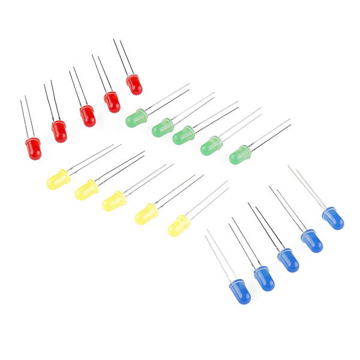
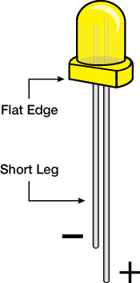
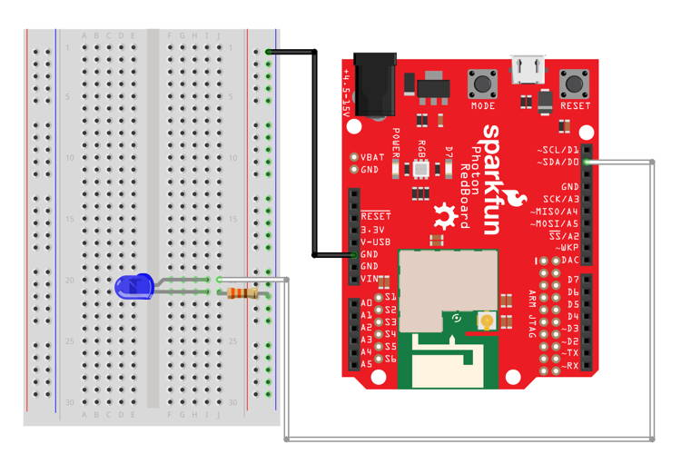

# LED Lights

LEDs \(light-emitting diodes\) are small, bright, long-lasting, energy-efficient lights.  LEDs have been commonly used in electronic products for decades. More recently, incandescent light bulbs used in homes and other buildings are being replaced with LED light bulbs due to their energy efficiency.

Your Photon kit should have a set of LED lights in various colors:  red, yellow, green, and blue.



## How to Connect LED

An LED light is a [polarized](https://learn.sparkfun.com/tutorials/polarity) part, meaning there is one way to correctly connect its positive and negative terminals. If a polarized part is connected incorrectly \(by switching the positive and negative\), the part may not work or could become damaged.

Each LED in your Photon kit has a positive leg and a negative leg. These can be identified visually by length:  the negative leg has been made slightly shorter.



You will use a breadboard to help connect the LED to your Photon circuit board. The negative leg will be connected to GND \(-\) through a resistor. The positive leg will be connected to an I/O pin, which will serve as the voltage source \(+\).

### Bend LED Positive Leg

To make it easier to insert the LED into a breadboard, you can carefully bend the **positive** leg as shown below, so both legs have the same height. You can still identify them visually:  the straight leg is the negative leg, and the bent leg is the positive leg.


### Bend Resistor Legs

An LED can be easily burned out if it receives too much power. Therefore, a [resistor](https://learn.sparkfun.com/tutorials/resistors) must be used to limit the amount of current flowing through the LED. The resistor is used to connect the negative leg of the LED to a GND \(-\) pin.

Your Photon kit contains a set of resistors with a resistance rating of 330 Ohms. In order to insert a resistor into the pin holes of a breadboard, you will need to bend both resistor legs into ~90° angles:


### Connect to Breadboard

To connect an LED light to your Photon using the breadboard, you will need:

* LED light with bent positive leg
* Resistor with bent legs
* 2 jumper wires \(use different colors to help identify them\)

| LED Light | Photon Pin |
| :--- | :--- |
| Positive Leg \(bent\) = Power | any I/O pin |
| Negative Leg = Ground | GND using resistor |

Here are the steps to connect the LED light to your Photon using the breadboard:

1. Insert the positive and negative legs of the LED into **different** terminal strip rows on the breadboard. \(Different terminal strip rows have different row numbers.\)
2. Plug one end of a **jumper wire** into the **same** terminal strip row as the bent **positive** leg of the LED. Plug the other end of this same jumper wire into an I/O pin on the Photon circuit board.
3. Insert one end of the **resistor** into the **same** terminal strip row as the **negative** leg of the LED. Insert the other end of the resistor into a pin hole of the negative column of the closest power rail on the breadboard.
4. If the negative power rail isn't already connected to a GND pin on the Photon circuit board, then plug one end of the **other** jumper wire into another pin hole in the negative power rail, and plug the other end of this same jumper wire into a GND pin on the Photon circuit board.

Here's a wiring diagram showing a possible way to connect an LED light:



Keep in mind that your connection can look different than this example diagram:

* Your LED legs could be inserted into different row numbers on the breadboard than the example \(which happens to connect the positive leg to row 20 and the negative leg to row 21\).
* Your LED legs could be inserted into different columns on the breadboard than the example \(which happens to connect the LED legs into column I of the terminal strip rows\).
* The positive leg of your LED could connect to a different I/O pin than the example \(which happens to connect to the D0 pin on the Photon circuit board\).
* Your negative power rail on the breadboard could connect to a different GND pin than the example  \(there are two other available GND pins on the Photon circuit board\).

## How to Code LED

The basic steps to control an LED light in your app code are:

1. Declare a global variable to store the I/O pin number for the LED.
2. Set the pin mode for the LED pin in the `setup()` function.
3. Use `digitalWrite()` statements to turn the LED on or off. \(Another option is to use `analogWrite()` statements to control the brightness of the LED.\)

### Global Variable

You should declare a global variable to store the I/O pin number that the LED is connected to. This will make it easier to understand your code \(and easier to modify the code if you were to connect the LED to a different pin number\).

Add this code statement \(modify if necessary\) **before** the `setup()` function:

```cpp
int LED = D0;
```

This line of code does 3 things \(in order\):

1. **It declares a data type for the variable's value.**  In this case, `int` stands for integer \(whole number\). Photon pin numbers are always treated as `int` values \(even though they have letters\).
2. **It declares the variable's name.** In this example, the variable will be called `LED`. You can change the variable name, but choose a name that will make sense to anyone reading the code.
3. **It assigns a value to the variable.**  In this example, the variable's value will be equal to `D0`. If necessary, modify this value to match the actual I/O pin number that your LED is connected to.

#### MULTIPLE LED LIGHTS

If you have **multiple** LED lights connected to your Photon, then be sure to give each LED a unique variable name by adding an adjective or number to the variable names. For example:

```cpp
int redLED = D0;
int greenLED = D1;
```

### Set Pin Mode

You need to set the pin mode for the LED to be an output.

Add this code statement \(modify if necessary\) **within** the `setup()` function:

```cpp
pinMode(LED, OUTPUT);
```

The `pinMode()` method requires two parameters inside its parentheses \(in this order\):

1. **The I/O pin number**, which can be the actual pin number \(such as: `D0`, etc.\) or a variable that stores a pin number. In this example, a variable named `LED` is listed. If necessary, change this to match the variable name for your LED.
2. **The mode value**, which will always be `OUTPUT` for an LED light because your app will send "on" and "off" signals \(or brightness signals\) to the LED light.

#### MULTIPLE LED LIGHTS

If you have **multiple** LED lights connected to your Photon, then be sure to set the pin mode for each LED pin variable. For example:

```cpp
pinMode(redLED, OUTPUT);
pinMode(greenLED, OUTPUT);
```

### Turn LED On or Off

You can use the `digitalWrite()` method to turn an LED on or off.

Add this code statement \(modify if necessary\) to your app within the `setup()` function, `loop()` function, or a custom function:

```cpp
digitalWrite(LED, HIGH);
```

The `digitalWrite()` method requires two parameters inside its parentheses \(in this order\):

1. **The I/O pin number**, which can be the actual pin number \(such as: `D0`, etc.\) or a variable that stores a pin number. In this example, a variable named `LED` is listed. If necessary, modify this to match the variable name for your LED.
2. **The signal value**, which can be `HIGH` or `LOW`. Your Photon uses this value to send an electrical signal through the pin: `HIGH` is a signal of 3.3 volts which represents "on," while `LOW` is a signal of 0 volts which represents "off."  Modify this value to either turn the LED on or off.


**DIM LED WHEN PHOTON STARTS:**  Depending on which I/O pin an LED is connected to, the LED light might be on \(at a dim brightness\) when your Photon app first starts.

If you need an LED light to be **turned off** when your app first starts running, then be sure to include code to turn off the LED within the `setup()` function after setting its pin mode.


### Adjust LED Brightness

Alternatively, you can use the `analogWrite()` method to adjust the brightness of an LED from minimum \("off"\) to maximum – or any value in-between.

However, the LED light must be connected to an I/O pin capable of PWM output. PWM stands for [pulse-width modulation](https://learn.sparkfun.com/tutorials/pulse-width-modulation), which is a way to make a digital output signal \(which has only two values: HIGH or LOW\) act like an analog output signal \(which has a range of values\). 

* These I/O pins are capable of PWM output:  D0, D1, D2, D3, A4, A5.

Add this code statement \(modify as necessary\) to your app within the `setup()` function, `loop()` function, or a custom function:

```cpp
analogWrite(LED, 128);
```

The `analogWrite()` method requires two parameters inside its parentheses \(in this order\):

1. **The I/O pin number**, which can be the actual pin number \(such as: `D0`, etc.\) or a variable that stores a pin number. In this example, a variable named `LED` is listed. If necessary, modify this to match the variable name for your LED.
2. **The signal value**, which can be any integer value \(whole number\) between 0-255. Your Photon uses this value to send a PWM electrical signal through the pin: `0` is minimum brightness \(LED will be off\) while `255` is maximum brightness. In this example, a value of `128` represents 50% brightness. Modify this value based on the brightness needed.

#### ANALOG VS. DIGITAL

The `analogWrite()` and `digitalWrite()` methods are both capable of setting an LED to either minimum or maximum brightness:

* Setting an LED to **minimum brightness** \("off"\) using `analogWrite(LED, 0)` produces the same result as using `digitalWrite(LED, LOW)` 
* Setting an LED to **maximum brightness** using `analogWrite(LED, 255)` produces the same result as using `digitalWrite(LED, HIGH)`

However, the `analogWrite()` method is the only way to set an LED to a brightness value in-between these two extremes:

* `analogWrite(LED, 64)` would set the LED to 25% brightness
* `analogWrite(LED, 128)` would set the LED to 50% brightness
* `analogWrite(LED, 192)` would set the LED to 75% brightness
* etc.


