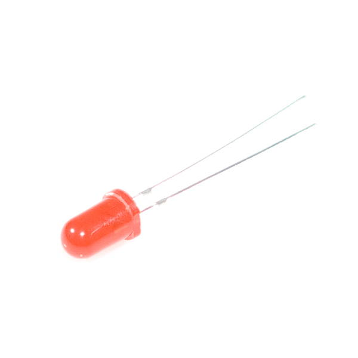

# LED Lights

LEDs \(light-emitting diodes\) are small, bright, long-lasting, energy-efficient lights.  LEDs have been commonly used in electronic products for decades. More recently, incandescent light bulbs used in homes and other buildings are now being replaced with LED light bulbs due to their energy efficiency.

## How to Connect LED

An LED light is a [polarized](https://learn.sparkfun.com/tutorials/polarity) part, meaning it has positive and negative wires that have to be connected correctly to the positive and negative terminals of a power source. If a polarized part is connected incorrectly \(by switching the positive and negative wires\), the part may not work or could become damaged.

Each LED in your Photon kit has a positive leg and a negative leg. These can be identified visually by length:  the negative leg has been made slightly shorter.

You will use the breadboard to help connect the LED to your Photon circuit board. The negative leg will be connected to GND \(-\) using a resistor. The positive leg will be connected to an I/O pin, which will serve as the voltage source \(+\). 

### Bend Positive Leg

To make it easier to insert the LED into a breadboard, you can carefully bend the **positive** leg as shown below, so both legs have the same height. You can still identify them visually:  the straight leg is the negative leg, and the bent leg is the positive leg.

### Connect with Resistor

An LED can be easily burned out if it receives too much power. Therefore, a [resistor](https://learn.sparkfun.com/tutorials/resistors) **must** be used to help limit the amount of current flowing through the LED. The resistor is used with a breadboard to help connect the negative leg of the LED to a GND \(-\) pin.

In order to insert the resistor into the pin holes of a breadboard, you will need to bend both its wire legs into approximately 90° angles:

