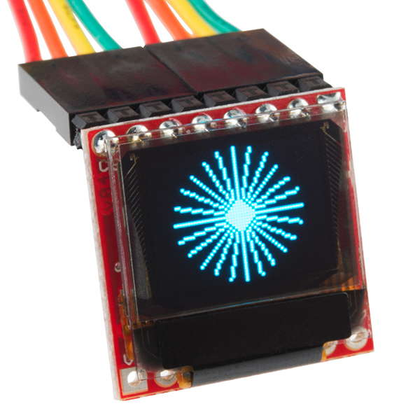

# Micro OLED Display

The Micro OLED display included in your Photon kit is a monochrome, blue-on-black screen that is 64 pixels in width and 48 pixels in height. It can be used to display text, simple graphics, or a combination.

## How to Connect Micro OLED

To connect the Micro OLED display to your Photon using the breadboard, you will need:

* Micro OLED display
* 7 jumper wires \(use different colors to help identify them\)

The Micro OLED has pins located along the top edge of the display. There are labels for each pin printed on the underside of the Micro OLED circuit board.

If the pins along the top edge of the display were numbered left to right as 1-8, the connections for the jumper wires will be:

| OLED Pin | Photon Pin |
| :--- | :--- |
| Pin 1 - CS | A2 |
| Pin 2 - RST | D6 |
| Pin 3 - D/C | D5 |
| Pin 4 - SDO | \(None\) |
| Pin 5 - SCK | A3 |
| Pin 6 - SDI | A5 |
| Pin 7 - 3V3 | 3.3V |
| Pin 8 - GND | GND |

Here are the steps to connect the Micro OLED to your Photon using the breadboard:

1. Insert the 8 pins of the Micro OLED into **different** terminal strip rows on the breadboard. \(Different terminal strip rows have different row numbers.\)
2. Plug one end of a **jumper wire** into the **same** terminal strip row as the **first OLED pin \(CS\)**. Plug the other end of this jumper wire into the correct pin on the Photon circuit board.
3. Repeat step 2 with the other jumper wires until each OLED pin is connected to its correct Photon pin. **NOTE:** The **fourth OLED pin \(SDO\)** will **not** be connected to anything.


**TWIN PINS:** Analog pins A2, A3, A4, and A5 are each represented by **two** pins on the Photon board. The duplicate pins are labeled as: SS/A2, SCK/A3, MISO/A4, MOSI/A5.

However, the Micro OLED has to connect to **only one** A2 pin – **not** both. The same goes for connecting the Micro OLED to the A3 and A5 pins.

The only limitation is that once you connect the Micro OLED, you will **not** be able to have a different part \(such as an LED, etc.\) connected to the other A2, A3, or A5 pins.


## How to Code Micro OLED

