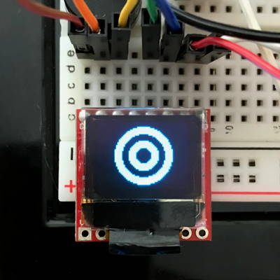

# Micro OLED Display

The Micro OLED display included in your Photon kit is a monochrome \(single-color\) screen that is 64 pixels in width and 48 pixels in height. It can be used to display text, simple graphics, or a combination.


## How to Connect Micro OLED

To connect the Micro OLED display to your Photon using the breadboard, you will need:

* Micro OLED display
* 7 jumper wires \(use different colors to help identify them\)

The Micro OLED has pins located along the top edge of the display. There are labels for each pin printed on the underside of the Micro OLED circuit board.

If the pins along the top edge of the display were numbered left to right as 1-8, the connections for the jumper wires will be:

| OLED Pin | Photon Pin |
| :--- | :--- |
| Pin 1 – CS | A2 |
| Pin 2 – RST | D6 |
| Pin 3 – D/C | D5 |
| Pin 4 – SDO | \(None\) |
| Pin 5 – SCK | A3 |
| Pin 6 – SDI | A5 |
| Pin 7 – 3V3 | 3.3V |
| Pin 8 – GND | GND |


**3.3V MAXIMUM:**  Connect the Micro OLED to the 3.3V pin on your Photon, or connect it to a positive power rail on the breadboard that's connected to the 3.3V pin.

Do **NOT** connect to VIN or V-USB because the higher voltage could damage the display.


Here are the steps to connect the Micro OLED to your Photon using the breadboard:

1. Insert the 8 pins of the Micro OLED into **different** terminal strip rows on the breadboard. \(Different terminal strip rows have different row numbers.\)
2. Plug one end of a **jumper wire** into the **same** terminal strip row as the **first OLED pin \(CS\)**. Plug the other end of this jumper wire into its corresponding pin on the Photon circuit board.
3. Repeat step 2 with the other jumper wires until each OLED pin is connected to its correct Photon pin. **NOTE:** The **fourth OLED pin \(SDO\)** will **not** be connected to anything.


**TWIN PINS:** Analog pins A2, A3, A4, and A5 are each represented by **two** pins on the Photon board. The duplicate pins are labeled as: SS/A2, SCK/A3, MISO/A4, MOSI/A5.

However, the Micro OLED has to connect to **only one** A2 pin – **not** both. The same goes for connecting the Micro OLED to the A3 and A5 pins.

The only limitation is that once you connect the Micro OLED, you will **not** be able to have a different part \(such as an LED, etc.\) connected to the other A2, A3, or A5 pins.


Here's a wiring diagram showing a possible way to connect a servo motor \(ignore the wiring for the three push buttons\):


Keep in mind that your connection can look different than this example diagram:

* Your Micro OLED pins could be inserted into **different row numbers** on either breadboard side. \(The example connects the OLED pins to rows 1-8 on the right side of the breadboard\).
* Your Micro OLED pins could be inserted into a **different column** of the breadboard. \(The example connects the OLED pins into column F of the terminal strip rows\).
* Your Micro OLED could connect \(through jumper wires\) to the **other A2, A3, and A5 pins** located on the lower left side of the Photon circuit board.
* Your Micro OLED 3V3 pin could connect \(through a jumper wire\) **either directly to the 3.3V pin** **or to a positive power rail that's connected to the 3.3V pin.**
* Your Micro OLED GND pin could connect \(through a jumper wire\) **either directly to a GND pin or to a negative power rail that's connect to a GND pin**. \(There are three available GND pins on the Photon circuit board.\)

## How to Code Micro OLED

The basic steps to control the Micro OLED display in your app code are:

1. Include the SparkFun Micro OLED library in your app.
2. Define the I/O pin numbers for certain Micro OLED pins.
3. Create a `MicroOLED` object assigned to a global variable called `oled`.
4. Use the `oled.begin()` method to start the display in the `setup()` function.
5. Use various `oled` methods to display text or simple graphics on the screen.

### Include Library

Your Photon app must include a code library that will allow you to control the Micro OLED display.


1. In Particle Build, click on the Libraries icon to open the Libraries menu panel.
2. Type `oled` into the search field. Select the result called: **SPARKFUNMICROOLED**
3. Click the button to "Include in Project"
4. Select the name of your Photon app, and then click the "Confirm" button

Particle Build will **automatically** insert this `#include` statement at the beginning of your app code:

```cpp
// This #include statement was automatically added by the Particle IDE.
#include <SparkFunMicroOLED.h>
```

### Define Pins & Create Object

You need to define the I/O pin numbers for certain Micro OLED pins. This is similar to declaring global variables \(except defined values are not allowed to change\).

You will also need to create an object using the `MicroOLED` class defined in the included library, and assign this object to a global variable.

Add this code **before** the `setup()` function:

```cpp
#define PIN_OLED_RST D6
#define PIN_OLED_DC  D5
#define PIN_OLED_CS  A2
MicroOLED oled(MODE_SPI, PIN_OLED_RST, PIN_OLED_DC, PIN_OLED_CS);
```

The **first three lines of code** define the I/O pin numbers for three specific OLED pins.

The **fourth line of code** creates a new object using the `MicroOLED` class, and assigns the object to a global variable named `oled`.

### Start OLED in Setup

The `oled.begin()` method is used to start the Micro OLED display, which should typically be done when your app first starts running.

Add this code statement within the `setup()` function to start the OLED display:

```cpp
oled.begin();
```

The `oled.begin()` method will initialize the settings \(including pin modes\) for the Micro OLED and turn it on.

### Display Text

Displaying text on the Micro OLED screen requires a sequence of five steps:

1. Clear the screen using the `oled.clear()` method.
2. Set the font type using the `oled.setFontType()` method.
3. Set the cursor position using the `oled.setCursor()` method.
4. Print text to the screen using the `oled.print()` and/or `oled.println()` methods.
5. Display the printed text using the `oled.display()` method.

For example:

```cpp
    oled.clear(PAGE);
    oled.setFontType(0);
    oled.setCursor(0,0);
    oled.println("Hello");
    oled.display();
```

Rather than listing all these code statements within the `loop()` function, you may want to create a custom function that contains all the code to display your text. Then you can call this custom function within the `loop()` function.

#### 1. CLEAR SCREEN

To clear the screen before adding text or graphics:

```cpp
oled.clear(PAGE);
```

#### 2. SET FONT TYPE

The SparkFun Micro OLED library includes 4 available font types \(numbered 0-3\), which differ in font size and in which characters can be displayed:

| Font Type | Font Size | Characters Allowed | Used For |
| :--- | :--- | :--- | :--- |
| 0 | 5×7 pixels \(10 columns by 6 rows\) | any [ASCII character](https://www.w3schools.com/charsets/ref_html_ascii.asp) | General |
| 1 | 8×16 pixels \(6 columns by 3 rows\) | any character on keyboard | General |
| 2 | 10×16 pixels \(5 columns by 3 rows\) | only numbers and period | Numbers |
| 3 | 12×48 pixels \(5 columns by 1 row\) | only numbers and colon | Numbers or Time |

By default, the Micro OLED will be set to font type 0 by the `oled.begin()` method.

You can use the `oled.setFontType()` method to set the font type by including the font type number within the parentheses:

```cpp
oled.setFontType(0);
```

You can use a mix of different font types by setting a new font type before printing a new line of text.

For example:

```cpp
    oled.setFontType(0);
    oled.println("Hello");
    oled.setFontType(1);
    oled.println("World");
```

#### 3. SET CURSOR POSITION

The cursor position represents the starting position for printing text to the screen. The cursor can be set to any `(x,y)` position on the screen. The OLED screen is 64 pixels wide by 48 pixels tall:

* The `x` positions are numbered left to right as 0-63
* The `y` positions are numbered top to bottom as 0-47

For example, to have your text start at the top-left corner of the screen:

```cpp
oled.setCursor(0,0);
```

As you print text to the screen, the OLED display will automatically move the cursor position, so the next text printed to the screen will start at the next screen position.

However, if desired, you can adjust the text layout by setting a new cursor position before printing a line of text, so the new text will start printing at a specific position on the screen.

For example:

```cpp
    oled.setCursor(20,10);
    oled.println("Hello");
    oled.setCursor(20,30);
    oled.println("World");
```

#### 4. PRINT TEXT

The `oled.print()` and `oled.println()` methods can be used to print text \(or variable values\) to the screen. Text that is longer than the screen column width will automatically wrap to the next line.

#### Print Text Within Quotation Marks

To print text directly, include the text inside the method's parentheses by listing the text within double quotation marks:

```cpp
oled.println("Hello");
```

#### Print Value of Variable

To print the value stored in a **variable**, include the variable name inside the method's parentheses.:

```cpp
oled.println(myName);
```

In this case, `myName` is a variable name \(presumably a person's name\). Change this to the name of your variable, which could store a text string or number.

#### Print Decimal Value to Certain Number of Digits

If a variable stores a **decimal** number \(data type is `float` or `double`\), you have the option of indicating how many digits **after** the decimal point to show when printing the variable's value:

```cpp
oled.println(roomTemp, 1);
```

In this case, `roomTemp` is a variable name that stores a decimal value \(presumably a temperature sensor measurement\). Its value will be displayed to `1` digit after the decimal point. So if the actual variable value were `70.1584275`, it would be printed on the screen as: `70.2` \(the last digit is automatically rounded up if necessary\).

#### PRINT vs. PRINTLN

There are two different print methods that can display text on the Micro OLED screen: 

* `oled.print()` will print text to the screen, but the cursor will remain on the **same** line. The next text printed to the screen will start where the last text ended.
* `oled.println()` will print text to the screen, and then move the cursor to the start of a **new** line. The next text printed to the screen will start on the new line.

The `oled.print()` command is useful for combining text and variable values on the **same** line.

For example, if you had a variable named `hour` that stored the hour of the current time and another variable named `minutes` that stored the minutes, you could combine these together on the screen:

```cpp
oled.print("Time ");
oled.print(hour);
oled.print(":");
oled.println(minutes);
```

Notice that the last code statement used the `oled.println()` method to move the cursor to a new line for any text that might be printed after the time.

#### Print Blank Line

To add a blank line, just use the `oled.println()` method **without** anything inside its parentheses:

```cpp
oled.println();
```

#### 5. DISPLAY SCREEN

Any text or graphics will **NOT** be shown until the OLED is instructed to display the screen:

```cpp
oled.display();
```

### Display Graphics

Displaying simple graphics on the Micro OLED screen requires a sequence of three steps:

1. Clear the screen using the `oled.clear()` method.
2. Draw graphics \(dots, lines, rectangles, circles\) on the screen using various methods.
3. Display the graphics using the `oled.display()` method.

For example:

```cpp
    oled.clear(PAGE);
    oled.circleFill(32, 24, 10);
    oled.display();
```

Rather than listing all these code statements within the `loop()` function, you may want to create a custom function that contains all the code to display your graphics. Then you can call this custom function within the `loop()` function.

The following drawing methods are available:

* `oled.pixel()` can be used to draw a dot
* `oled.line()`, `oled.lineH()`, and `oled.lineV()` can be used to draw a line
* `oled.rect()` and `oled.rectFill()` can be used to draw a rectangle
* `oled.circle()` and `oled.circleFill()` can be used to draw a circle

All of the drawing methods require parameters for the \(x, y\) position of a point. The OLED screen is 64 pixels wide by 48 pixels tall:

* The `x` positions are numbered left to right as 0-63
* The `y` positions are numbered top to bottom as 0-47

#### DRAW DOT

The `oled.pixel()` method can be used to draw a dot at specific point:

```cpp
oled.pixel(x, y);
```

For example, to draw a dot at the center of the screen:

```cpp
oled.pixel(32, 24);
```

#### DRAW LINE

The `oled.line()` method can be used to draw a **straight line** from one point `(x1, y1)` to another point `(x2, y2)`:

```cpp
oled.line(x1, y1, x2, y2);
```

For example, to draw a line from the top-left corner \(0,0\) to the bottom-right corner \(63, 47\):

```cpp
oled.line(0, 0, 63, 47);
```

#### DRAW HORIZONTAL LINE

The `oled.lineH()` method can be used to draw a **horizontal line** that starts from a specific point \(representing the left end of the line\) and has a specified width:

```cpp
oled.lineH(x, y, width);
```

For example, to draw a horizontal line that starts at \(12, 24\) and has a width of 40 pixels:

```cpp
oled.lineH(12, 24, 40);
```

#### DRAW VERTICAL LINE

The `oled.lineV()` method can be used to draw a **vertical line** that starts from a specific point \(representing the top end of the line\) and has a specified height:

```cpp
oled.lineV(x, y, height);
```

For example, to draw a vertical line that starts at \(32, 9\) and has a height of 30 pixels:

```cpp
oled.lineH(32, 9, 30);
```

#### DRAW OUTLINE OF RECTANGLE

The `oled.rect()` method can be used to draw an **outline of a rectangle** that starts from a specific point \(representing the top-left corner of the rectangle\) and has a specified width and height:

```cpp
oled.rect(x, y, width, height);
```

For example, to draw an outline of a rectangle with its top-left corner at \(12, 14\) with a width of 40 pixels and a height of 20 pixels:

```cpp
oled.rect(12, 14, 40, 20);
```

#### DRAW FILLED RECTANGLE

The `oled.rectFill()` method can be used to draw a **solid \(filled\) rectangle** that starts from a specific point \(representing the top-left corner of the rectangle\) and has a specified width and height:

```cpp
oled.rectFill(x, y, width, height);
```

For example, to draw a filled rectangle with its top-left corner at \(12, 14\) with a width of 40 pixels and a height of 20 pixels:

```cpp
oled.rectFill(12, 14, 40, 20);
```

#### DRAW OUTLINE OF CIRCLE

The `oled.circle()` method can be used to draw an **outline of a circle** that has its center at specific point and has a specified radius:

```cpp
oled.circle(x, y, radius);
```

For example, to draw an outline of a circle with its center at \(32, 24\) and a radius of 20 pixels:

```cpp
oled.circle(32, 24, 20);
```

#### DRAW FILLED CIRCLE

The `oled.circleFill()` method can be used to draw a **solid \(filled\) circle** that has its center at specific point and has a specified radius:

```cpp
oled.circleFill(x, y, radius);
```

For example, to draw a filled circle with its center at \(32, 24\) and a radius of 20 pixels:

```cpp
oled.circleFill(32, 24, 20);
```

#### DRAW WITH BLACK

By default, all the drawing methods will draw using "white" pixels \(which are actually light blue on your Micro OLED screen\). However, you can modify each method to draw using black pixels instead, which represents erasing.

Any of the drawing methods can be modified to draw using black pixels by adding `BLACK, NORM` as the last two parameters inside the method's parentheses.

For example, to draw a black dot:

```cpp
oled.pixel(x, y, BLACK, NORM);
```

For example, to draw a black line:

```cpp
oled.line(x1, y1, x2, y2, BLACK, NORM);
```

For example, to draw solid \(filled\) black circle:

```cpp
oled.circleFill(x, y, radius, BLACK, NORM);
```

The black pixels will only be visible if drawn on top of a white shape, so the black pixels erase white pixels.

For example, this code draws a white filled circle with its center at \(32, 24\) and a radius of 20 pixels, and then draws a black filled circle that also has its center at \(32, 24\) but with a radius of 10 pixels:

```cpp
oled.circleFill(32, 24, 20);
oled.circleFill(32, 24, 10, BLACK, NORM);
```

By drawing the black circle **after** the white circle, the black circle will erase part of the white circle.

You can also create more complex patterns by drawing a series of white and black shapes:

```cpp
oled.circleFill(32, 24, 20);
oled.circleFill(32, 24, 15, BLACK, NORM);
oled.circleFill(32, 24, 10);
oled.circleFill(32, 24, 5, BLACK, NORM);
```

This example code draws 4 filled circles that have the same center but each have a different radius:

1. First, a white filled circle with a radius of 20 pixels is drawn.
2. Then, a black filled circle with a radius of 15 pixels erases part of the white circle.
3. Then, a new white filled circle with a radius of 10 pixels is added.
4. Finally, a black filled circle with a radius of 5 pixels erases part of the second white circle.

The overall pattern ends up looking like a "target" symbol:



### Display Text + Graphics

You can also combine text and graphics on the OLED screen at the same time. For example:

```cpp
    oled.clear(PAGE);
    oled.setFontType(0);
    oled.setCursor(18,0);
    oled.println("Hello");
    oled.circleFill(32, 24, 10);
    oled.setCursor(18,41);
    oled.println("World");
    oled.display();
```

