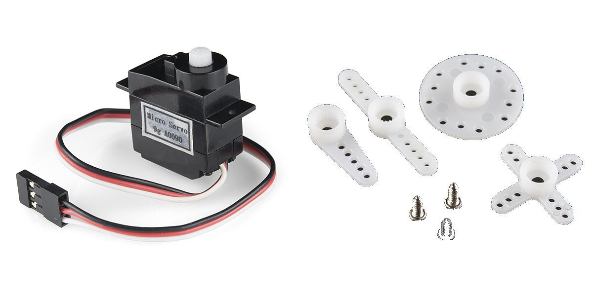
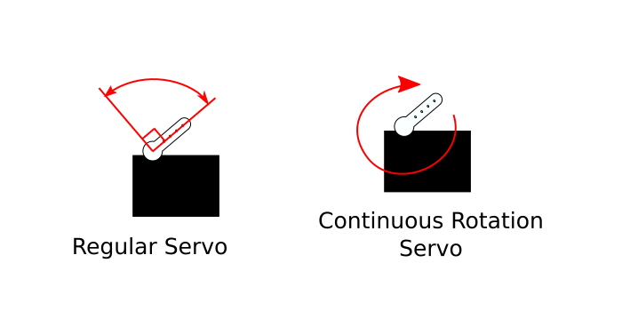
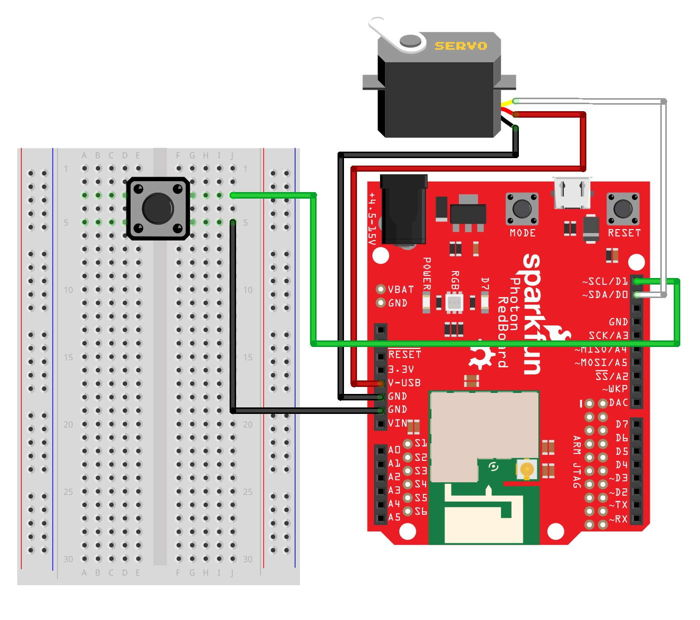

# Servo Motor

The servo motor included in your Photon kit can rotate back or forth to any position between 0° and ~180° and hold its position.



The servo motor comes with 4 different plastic mounts called "horns" that can be attached to the motor axis \(the white part sticking out of the top of the motor – this is what actually rotates\). There is a single-arm horn, a double-arm horn, a four-point horn, and a circular horn. Each horn slips onto the motor axis \(the horn and axis have matching "teeth"\). Each horn has holes, which can allow you to attach something to the horn using the included screws.

#### NO CONTINUOUS ROTATION

This servo motor can rotate to a specific angle \(up to ~180°\) and hold its position. It does **NOT** rotate continuously, like a motor used in a fan or an engine. If your IoT device requires a motor that can rotate continuously, then you need a [gear motor](https://www.sparkfun.com/products/11696) or a [continuous rotation servo motor](https://www.sparkfun.com/products/9347).



## How to Connect Servo Motor

The servo motor has a built-in 3-wire connector. You'll plug 3 jumper wires into the connector, and then plug the other end of each wire into the breadboard or directly into a pin on the Photon circuit board.

### Requires PWM Pin {#requires-pwm-pin}

The white wire of the servo motor must be connected to an I/O pin capable of [pulse-width modulation](https://learn.sparkfun.com/tutorials/pulse-width-modulation) \(PWM\), which is a process used to make a digital output signal \(which has only two values: HIGH or LOW\) act like an analog output signal \(which has a range of values\).

These I/O pins on your Photon circuit board are capable of PWM output: A4, A5, D0, D1, D2, D3.

### Connect to Photon

To connect a servo motor to your Photon using the breadboard, you will need:

* Servo Motor \(with 3-wire connector\)
* 3 jumper wires \(use different colors to help identify them; it may help to match the motor wires\)

| Servo Motor | Photon Pin |
| :--- | :--- |
| White – Data | any I/O pin capable of PWM output |
| Red – Power \(4.8-6V\) | 5V through VIN or V-USB |
| Black – Ground | GND |

Here are the steps to connect the servo motor to your Photon using the breadboard:

1. Plug one end of a **jumper wire** into the **motor's white wire connector**. Plug the other end of this jumper wire into a **PWM-capable** I/O pin on the Photon circuit board.
2. Plug one end of a **second jumper wire** into the **motor's red wire connector**. Plug the other end of this jumper wire into either the VIN pin or V-USB pin on the Photon circuit board \(or to a **positive** power rail on the breadboard that is connected to VIN or V-USB\). If your Photon is being powered through the barrel jack, connect to the VIN pin. Otherwise, if your Photon is being powered through the Micro-USB port, connect to the V-USB pin.
3. Plug one end of a **third jumper wire** into the **motor's black wire connector**. Plug the other end of this jumper wire into a pin hole connected to GND:  either plug it into a negative power rail \(which is connected to GND via a different jumper wire\), or plug it directly into a GND pin on the Photon circuit board.

Here's a wiring diagram showing a possible way to connect a servo motor \(ignore the wiring for the push button\):



Keep in mind that your connection can look different than this example diagram:

* Your servo motor's white wire could connect to a **different I/O pin capable of PWM output**. \(The example connects to the D0 pin on the Photon circuit board\).
* Your servo motor's red wire could connect \(through a jumper wire\) to **either the VIN pin or V-USB pin** – **or to a positive power rail that's connected to one of these pins.** \(The example connects directly to the V-USB pin on the Photon circuit board\).
* Your servo motor's black wire could connect \(through a jumper wire\) to **either a negative power rail or a different GND pin**. \(There are three available GND pins on the Photon circuit board.\)

### Connect Horn to Motor

Be sure to attach one of the horns to your servo motor. Otherwise, rotating the motor won't provide much use to your device.

Later, once you test out your code to rotate the servo motor, you may need to remove and re-position the horn, so it's lined up where you want it to be as it rotates to specific angles. The best way to do this is to rotate the servo motor to 0° \(or another specific angle, such as 90°\) and then remove & re-position the horn to be pointed correctly for this particular angle.

## How to Code Servo Motor

The basic steps to control a servo motor in your app code are:

1. Declare a global variable to store the I/O pin number for the servo motor.
2. Create a `Servo` object assigned to a global variable called `servo`.
3. Use a sequence of `servo.attach()`, `servo.write()`, and `servo.detach()` statements to rotate the motor to a specific angle.

### Library {#library}

The servo motor requires a code library that defines a class called `Servo` which has built-in methods \(functions\) for controlling the motor. However, this library is **already** included in the Particle firmware on your Photon device, so you do **not** need an `#include` statement to add the library to your app.

### Global Variables

You should declare a global variable to store the I/O pin number that the servo motor is connected to. This will make it easier to understand your code \(and easier to modify the code if you were to connect the servo motor to a different pin number\).

You will also need to create an object using the `Servo` class included in the Particle firmware, and assign this object to a global variable.

Add this code \(modify if necessary\) **before** the `setup()` function:

```cpp
int motor = D0;
Servo servo;
```

The **first line of code** does 3 things \(in order\):

1. **It declares a data type for the variable's value.**  In this case, `int` stands for integer \(whole number\). Photon pin numbers are always treated as `int` values \(even though they have letters\).
2. **It declares the variable's name.** In this example, the variable will be called `motor`. You can change the variable name, but choose a name that will make sense to anyone reading the code.
3. **It assigns a value to the variable.**  In this example, the variable's value will be equal to `D0`. If necessary, modify this value to match the actual I/O pin that your servo motor is connected to.

The **second line of code** creates a new object using the `Servo` class, and assigns the object to a global variable named `servo`. 

**NOTE:** The `Servo` class name starts with an uppercase letter "S", while the `servo` object variable name starts with a lowercase letter "s".


**NO PIN MODE:**  Because you are controlling the servo motor using an object, you do **not** have to set a pin mode for the servo motor within the `setup()` function.


### Function to Rotate Servo {#rotate-servo-motor-to-specific-angle}

The servo motor can rotate back or forth to any position between 0° and ~180° and hold its position.

Rotating the servo motor to a specific angle requires a sequence of four steps:

1. Turn on the motor using the `servo.attach()` method.
2. Rotate the motor to a specific angle using the `servo.write()` method.
3. Allow time for the motor to finish rotating by using the `delay()` method.
4. Turn off the motor using the `servo.detach()` method.

You'll add a custom function named `rotateServo()` that will contain all these steps. The function will accept a parameter representing the desired angle of rotation.

Add this `rotateServo()` custom function **after** the `loop()` function:

```cpp
void rotateServo(int angle) {
    ​servo.attach(motor);
    servo.write(angle);
    delay(500);
    servo.detach();
}
```

The `rotateServo()` function requires a parameter for the specific angle of rotation. The parameter value must be an integer \(whole number\) and will be stored in a local variable named `angle`.

Here's what the code inside the `rotateServo()` function does:

1. The `servo.attach()` method turns on the motor. This method requires the servo motor I/O pin number. In this case, the global variable named `motor` stores this value. If you used a different name for the global variable storing your servo motor pin number, then insert that name instead.
2. The `servo.write()` method rotates the motor. This method requires an integer value from 0-180 representing the angle for the rotation. In this case, the parameter variable named `angle` stores the value that will be used.
3. A `delay()` of `500` ms \(0.5 seconds\) is included to give the motor enough time to physically rotate before turning the motor off again.
4. The `servo.detach()` method turns off the motor. Otherwise, if the motor isn't turned off, the motor will be "jittery" as it tries to hold its position. After you turn off the motor, you may notice that it "debounces" \(rotates backward slightly\). This is normal.

### Calling Servo Function

The `rotateServo()` function can be called within the `setup()` function, `loop()` function, or another custom function.

When calling the `rotateServo()` function, you must include the desired angle of rotation \(0-180\) within the parentheses after the function name.

For example, to make the servo motor rotate to an angle of 90°, insert this code statement to call the `rotateServo()` function:

```cpp
rotateServo(90);
```


**APPROX. 180°:**  In reality, this servo motor can only physically rotate to about 160°, even if it is told to rotate to 180°. Just keep this in mind as you design and build your device.



**CHECK HORN POSITION:** Once you've got your servo motor working, you may need to remove and re-position its horn, so the horn is lined up where you want it to be as it rotates to specific angles. The best way to do this is to rotate the servo motor to 0° \(or another specific angle, such as 90°\) and then remove and re-position the horn to be pointed correctly for this particular angle.



**ROTATE SERVO IN SETUP:**  In order to ensure that your device functions correctly, you should include a code statement to rotate your servo motor to a specific starting angle \(such as 0°, 90°, 180°, etc.\) in the `setup()` function. Otherwise, the servo motor will start at whatever angle it was at when the device was last powered off.


### Read Servo Angle

If necessary, the `servo.read()` method can be used to get the current angle of the servo motor. The method will return an integer value \(whole number\) between 0-180 representing the last angle used in the `servo.write()` method.

Add this code statement wherever you need to read the current angle of the servo motor:

```cpp
int angle = servo.read();
```

This code statement creates a local variable named `angle` to store the integer value returned by `servo.read()`.

