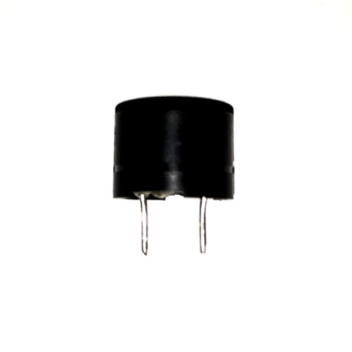
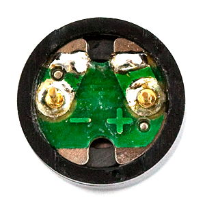
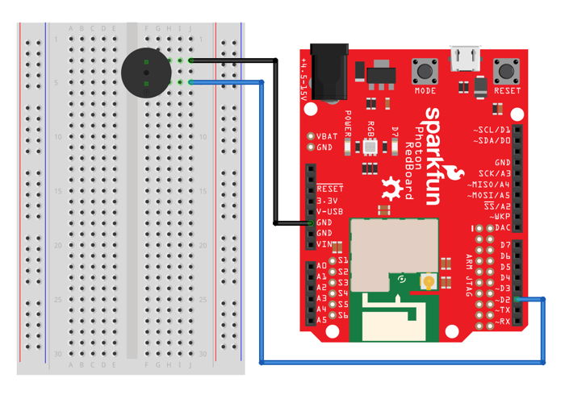

# Speaker

The small speaker included in the Photon kit can produce tones or play simple music \(note by note\). The speaker can produce tones ranging in frequency from 20Hz \(very low pitch\) to 20KHz \(very high pitch\), covering the full range of sounds that humans can hear.



## How to Connect Speaker

A speaker is a [polarized](https://learn.sparkfun.com/tutorials/polarity) part, meaning there is one way to correctly connect its positive and negative terminals. If a polarized part is connected incorrectly \(by switching the positive and negative\), the part may not work or could become damaged.

The speaker in your Photon kit has a positive leg and a negative leg. These can be identified by labels on the bottom of the speaker:



### Requires PWM Pin

The positive leg of the speaker must be connected to an I/O pin capable of [pulse-width modulation](https://learn.sparkfun.com/tutorials/pulse-width-modulation) \(PWM\), which is a process used to make a digital output signal \(which has only two values: HIGH or LOW\) act like an analog output signal \(which has a range of values\).

These I/O pins on your Photon circuit board are capable of PWM:  D0, D1, D2, D3, A4, A5.

### Connect to Breadboard

To connect a speaker to your Photon using the breadboard, you will need:

* Speaker
* 2 jumper wires \(use different colors to help identify them\)

| Speaker | Photon Pin |
| :--- | :--- |
| Positive Leg | any I/O pin capable of PWM |
| Negative Leg | GND |

Here are the steps to connect the speaker to your Photon using the breadboard:

1. Insert the positive and negative legs of the speaker into **different** terminal strip rows on the breadboard. \(Different terminal strip rows have different row numbers.\)
2. Plug one end of a **jumper wire** into the **same** terminal strip row as the **positive** leg of the speaker. Plug the other end of this jumper wire into a **PWM-capable** I/O pin on the Photon circuit board.
3. Plug one end of the **other jumper wire** into the **same** terminal strip row as the **negative** leg of the speaker. Plug the other end of this jumper wire into a pin hole connected to GND:  either plug it into a negative power rail \(which is connected to GND via a different jumper wire\), or plug it directly into a GND pin on the Photon circuit board.

Here's a wiring diagram showing a possible way to connect a speaker:



Keep in mind that your connection can look different than this example diagram:

* Your speaker legs could be inserted into **different row numbers** on the breadboard. \(The example connects the negative leg to row 3 and the positive leg to row 5\).
* Your speaker legs could be inserted into a **different column** on the breadboard. \(The example connects the LED legs into column F of the terminal strip rows\).
* The positive leg of your speaker could connect to a **different I/O pin**. \(The example connects to the D2 pin on the Photon circuit board\).
* The negative leg of your speaker could connect \(through a jumper wire\) to **either a negative power rail or a different GND pin**. \(There are three available GND pins on the Photon circuit board.\)

## How to Code Speaker

The basic steps to control a speaker in your app code are:

1. Declare a global variable to store the I/O pin number for the speaker.
2. Set the pin mode for the speaker pin in the `setup()` function.
3. Use `tone()` statements to produce sounds.

### Global Variable

You should declare a global variable to store the I/O pin number that the speaker is connected to. This will make it easier to understand your code \(and easier to modify the code if you were to connect the speaker to a different pin number\).

Add this code statement \(modify if necessary\) **before** the `setup()` function:

```cpp
int speaker = D2;
```

This line of code does 3 things \(in order\):

1. **It declares a data type for the variable's value.**  In this case, `int` stands for integer \(whole number\). Photon pin numbers are always treated as `int` values \(even though they have letters\).
2. **It declares the variable's name.** In this example, the variable will be called `speaker`. You can change the variable name, but choose a name that will make sense to anyone reading the code.
3. **It assigns a value to the variable.**  In this example, the variable's value will be equal to `D2`. If necessary, modify this value to match the actual I/O pin that your speaker is connected to.

### Set Pin Mode

You need to set the pin mode for the speaker to be used as an output.

Add this code statement \(modify if necessary\) **within** the `setup()` function:

```cpp
pinMode(speaker, OUTPUT);
```

The `pinMode()` method requires two parameters inside its parentheses \(in this order\):

1. **The I/O pin number**, which can be the actual pin number \(such as: `D0`, etc.\) or a variable that stores a pin number. In this example, a variable named `speaker` is listed. If necessary, change this to match the variable name for your speaker.
2. **The mode value**, which will always be `OUTPUT` for a speaker.

### Produce Tone

The `tone()` method is used to produce a sound of a specific frequency \(pitch\) for a specific duration of time. The speaker can produce tones ranging in frequency from 20Hz \(very low pitch\) to 20KHz \(very high pitch\), which covers the full range of sounds that humans can hear.

Add this code statement \(modify as necessary\) to your app within the `setup()` function, `loop()` function, or a custom function:

```cpp
tone(speaker, 2000, 250);
```

The `tone()` method requires three parameters inside its parentheses \(in this order\):

1. **The I/O pin number**, which can be the actual pin number \(such as: `D2`, etc.\) or a variable that stores a pin number. In this example, a variable named `speaker` is listed. If necessary, modify this to match the variable name for your speaker.
2. **The frequency for the tone**, which can be an integer value \(whole number\) or a variable that stores an integer. The value can be between 20-20000 hertz. Lower numbers will have a lower pitch, while higher numbers will have a higher pitch. In this example, the frequency will be `2000` hertz. Modify this value to the frequency you want for your sound.
3. **The duration for the tone**, which can be an integer number \(whole number\) or a variable that stores an integer. The value represents the number of milliseconds that the tone will be played \(1000 ms = 1 second\). In this example, the duration will be `250` ms \(0.25 seconds\).


**VOLUME:**  There **isn't** a way to change the volume of a tone produced by your Photon. However, you will notice that certain frequencies will naturally seem louder to your ears.


### Continuous Tone

If you want to produce a continuous tone that keeps playing, you can either use a **negative** value for the duration – or you can leave out the duration parameter entirely:

```cpp
tone(speaker, 2000); // continuous tone of 2000 hertz
```

To turn off a continuous tone, use the `noTone()` method when you're ready to stop the sound:

```cpp
noTone(speaker);
```


