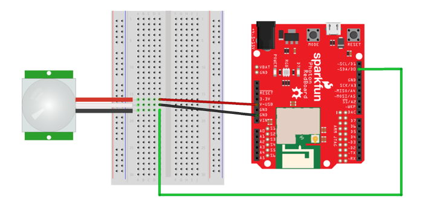

# 4.1 Connect Motion Sensor


**NEED LED & BUTTON:**  Be sure the LED and button used in your Smart Light device are **still** connected to your Photon. If not, [connect an LED light](https://docs.idew.org/code-internet-of-things/references/physical-outputs/led-lights#how-to-connect-led) and then [connect a push button](https://docs.idew.org/code-internet-of-things/references/physical-inputs/push-buttons#how-to-connect-button).


Your Photon kit includes a motion sensor that uses passive infrared \(PIR\) light to detect movement in the surrounding environment up to 10 feet away.

In this first step, your team will connect a motion sensor to your Photon circuit board using the breadboard.

You'll need these components:

* Motion sensor \(with 3-pin connector\)
* 3 jumper wires \(use different colors to help identify them; it may help to match the sensor wires\)

[Follow these instructions explaining how to connect the motion sensor](https://docs.idew.org/code-internet-of-things/references/physical-inputs/motion-sensor). The sensor can be connected to almost any I/O pin, but connect it to the **D3** pin \(which will be **different** than the wiring diagram\).

