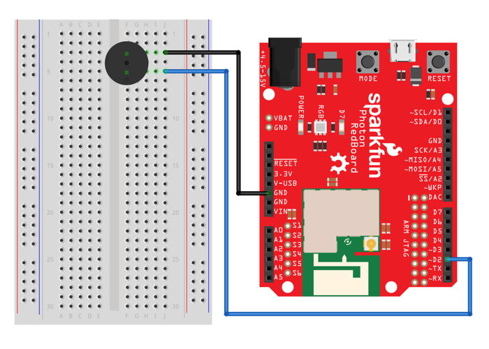

# 4.2 Connect Speaker

Your Photon kit includes a small speaker that can produce tones or play simple music \(note by note\).

In this step, your team will connect the speaker to your Photon circuit board using the breadboard.

You'll need these components:

* Speaker
* 2 jumper wires \(use different colors to help identify them\)

[​Follow these instructions explaining how to connect the speaker](https://docs.idew.org/code-internet-of-things/references/physical-outputs/speaker). The speaker can be connected to any I/O pin capable of PWM, but connect it to the **D1** pin \(which will be **different** from the wiring diagram\).

