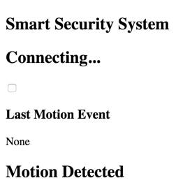

# 4.7 Web App HTML

Next, you'll create a web app that will interact with your Smart Security device through Particle Cloud. Your web app will consist of an HTML file named`index.html`, a CSS file named `style.css`, and a JavaScript file named `code.js`.

Particle Build is only used to code your Photon device app. You'll need to use a different code editor to create the HTML, CSS, and JS files for your web app. Consult your teacher to determine which code editor will be most appropriate to use for your web app files.

## Add Starter HTML

[Copy this starter HTML for your web app](https://docs.idew.org/code-internet-of-things/references/web-app#html), and paste it into a **blank** HTML file named `index.html`.

The starter HTML contains blank lines where you'll add custom HTML for your specific web app.

## Add Custom HTML

Copy this HTML, and paste it into the **blank lines** within your starter HTML code:

```markup
        <h2>Smart Security System</h2>
        <div class="card">
            <h2 id="system-mode">Connecting...</h2>
            <label class="switch">
                <input type="checkbox" name="toggle" onclick="toggleMode();">
                <span class="slider round"></span>
            </label>
            <h3>Last Motion Event</h3>
            <p id="event-time">None</p>
        </div>
        <div id="motion-alert" class="card">
            <h2>Motion Detected</h2>
        </div>
```

## Preview Web App

If you preview the web app at this point, it's very plain \(because there's no CSS in the `style.css` file\) and it doesn't function yet \(because there's no JS in the `code.js` file\).



  


