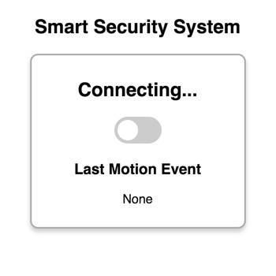

# D-8 Web App CSS

Next, you'll add the CSS for your web app's stylesheet.

## Add Starter CSS <a id="add-starter-html"></a>

​[Copy this starter CSS for your web app](https://docs.idew.org/code-internet-of-things/references/web-app#css), and paste it into a **blank** CSS file named `style.css`.

## Add Custom CSS <a id="add-custom-html"></a>

Copy this CSS, and add it **after** your starter CSS:

```css
.card {
    width: 250px;
    margin: 0 auto 20px;
    padding: 10px;
    color: black;
    background-color: white;
    border: 2px solid #aaa;
    border-radius: 10px;
    box-shadow: 0px 4px 8px rgba(0,0,0,0.2);
}

#motion-alert {
    display: none; /* hide until motion event notification */
    color: white;
    background-color: #ff3333; /* red */
}

/* CSS to change Checkbox Input into Toggle Switch */
.switch {
  position: relative;
  display: inline-block;
  width: 60px;
  height: 34px;
}

.switch input {
    display:none;
}

.slider {
  position: absolute;
  cursor: pointer;
  top: 0;
  left: 0;
  right: 0;
  bottom: 0;
  background-color: #ccc; /* gray when unchecked */
  -webkit-transition: .4s;
  transition: .4s;
}

.slider:before {
  position: absolute;
  content: "";
  height: 26px;
  width: 26px;
  left: 4px;
  bottom: 4px;
  background-color: white;
  -webkit-transition: .4s;
  transition: .4s;
}

input:checked + .slider {
  background-color: #00cc00; /* green when checked */
}

input:focus + .slider {
  box-shadow: 0 0 1px #00cc00;
}

input:checked + .slider:before {
  -webkit-transform: translateX(26px);
  -ms-transform: translateX(26px);
  transform: translateX(26px);
}

.slider.round {
  border-radius: 34px;
}

.slider.round:before {
  border-radius: 50%;
}
```

Your CSS should now have style declarations for several HTML elements:

1. The CSS for `body` styles the `<body>` section of your HTML.
2. The CSS for `.card` styles elements in your HTML that have `class="card"`. There are 2 `<div>` elements that have this class. The first `<div>` will be a "card" displaying information about your security system \(current mode, toggle switch for mode, and time of last motion event\). The second `<div>` will be a "card" displaying a pop-up notification when motion is detected.
3. The CSS for `#motion-alert` styles elements in your HTML that have `id="motion-alert"`. The second `<div>` has this id name and will be hidden \(`display: none`\). When a motion event notification is received, your web app JS will use jQuery to briefly show this "card" and then hide it.
4. The rest of the CSS \(for `.switch`, `.slider`, and `input`\) changes the checkbox input in your HTML to look and act like a toggle switch.

## Preview Web App <a id="preview-web-app"></a>

If you preview the web app at this point, you can see how the CSS has changed the appearance of the web app, but it still doesn't function yet \(because there's still no JS in the `code.js` file\).

If you click your toggle switch, it will change appearance using CSS \(but it requires JS to fully function\).



