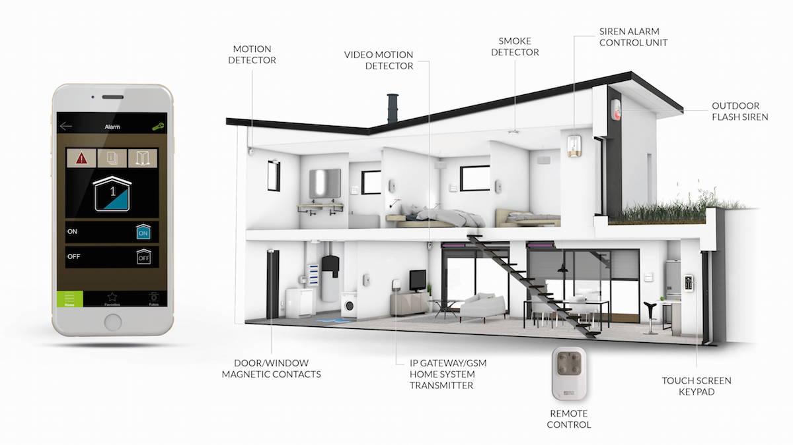

# 4. Smart Security Device

In this fourth tutorial, you'll modify your "Smart Light" device into a "Smart Security" device and program new apps for the device.

## Tutorial Goals

The goals of this fourth tutorial are to help you:

* Gain further experience by creating another practice IoT device and programming its apps
* Become better prepared to create your own IoT device and apps for your team project

## Smart Security System

For decades, security systems have been used to monitor homes and businesses for emergencies \(burglary, fire, flood, etc.\). These systems use some combination of: motion sensors, door/window sensors, glass break sensors, video cameras, smoke detectors, flood sensors, etc. Today, many security systems are being connected to the internet to offer additional features.

You'll create a prototype of a "Smart Security" device by modifying your "Smart Light" device \(which has an LED light and push button\) to add a motion sensor and a speaker:

* The **LED light** will be used to indicate whether the security system is currently "armed" \(LED is on\) or "disarmed" \(LED is off\).
* The **push button** will be used to switch the security system between "armed" and "disarmed" mode. \(The button will simulate a security system's keypad, which is used to enter a numeric passcode. For this prototype device, you'll simply press the button to toggle the system between modes, as if you had correctly entered a passcode.\)
* The **motion sensor** will detect whether something is moving within the surrounding area.
* The **speaker** will be used to produce an alarm sound if motion is detected.

You'll use your "Smart Light" device app as starter code for your "Smart Security" device app. You'll modify the code controlling the LED and button before adding new code to control the motion sensor and speaker.

You'll also program a web app that interacts with your Photon over the internet to perform these tasks:

* Monitor the security system's current mode \("armed" or "disarmed"\)
* Remotely toggle the security system between "armed" or "disarmed" mode
* Receive an event notification if the security system detects motion
* View the date and time of the last motion event detected

