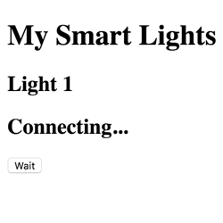

# 3.7 Web App HTML

Next, you'll create a web app that will interact with your Smart Light device through Particle Cloud. Your web app will consist of an HTML file named`index.html`, a CSS file named `style.css`, and a JavaScript file named `code.js`.  

Particle Build is only used to code your Photon device app. You'll need to use a different code editor to create the HTML, CSS, and JS files for your web app. Consult your teacher to determine which code editor will be most appropriate to use for your web app files.

## Add HTML

Copy this HTML, and paste it into a **blank** HTML file named `index.html`:

```markup
<!DOCTYPE html>
<html>
    <head>
		<meta charset="utf-8">
		<meta name="viewport" content="width=device-width, initial-scale=1">
        <title>Smart Light</title>
        <link href="style.css" rel="stylesheet" type="text/css">
    </head>
    <body>
        <h1>My Smart Lights</h1>
        <div id="light1" class="card">
            <h2 id="light1-name">Light 1</h2>
            <h2 id="light1-status">Connecting...</h2>
            <button id="light1-button" onclick="toggleLight1();">Wait</button>
        </div>
        <script src="https://cdnjs.cloudflare.com/ajax/libs/particle-api-js/7.2.3/particle.min.js"></script>
        <script src="https://cdnjs.cloudflare.com/ajax/libs/jquery/3.3.1/jquery.min.js"></script>
        <script src="code.js"></script>
</body>
</html>
```

This HTML does three main things:

1. It loads a CSS stylesheet file.
2. It loads three JavaScript files.
3. It displays a "card" with a name for the light, the light's status, and a button that will be used to remotely toggle the light on or off.

#### LOAD CSS STYLESHEET

Line 7 of the HTML has a `<link>` tag to load a CSS stylesheet file into your web app. The CSS stylesheet will be used to modify the appearance of certain HTML elements in your web app.

At the moment, your web app CSS file named `style.css` is either blank or hasn't been created yet.

#### LOAD JAVASCRIPT FILES

Lines 16-18 of the HTML contain `<script>` tags to load three JavaScript files into your web app:

1. Particle API JS library:  `particle.min.js`
2. jQuery JS library:  `jquery.min.js`
3. Your web app JS file:  `code.js`

The Particle API JS library contains methods to allow your web app to interact with your Photon device through Particle Cloud. You'll use Particle methods in your web app JS file.

The jQuery JS library contains methods that make it easy to modify the content and style of your web app by dynamically changing its HTML and CSS. You'll use jQuery methods in your web app JS file.

At the moment, your web app JS file named `code.js` is either blank or hasn't been created yet.

#### DISPLAY CARD FOR LIGHT

Lines 11-15 of the HTML contains a `<div>` section that will become a "card" displaying information about your Smart Light device. This card will display:

1. **The name of the light**, which is simply named `Light 1` in this case, but this could be changed to something more specific such as `Desk Light`, `Hall Light`, etc.
2. **The status of the light**, which has been displayed using the placeholder text of `Connecting...`. Once the web app has connected to Particle Cloud, your web app JS will dynamically change this text to display the actual light status as either `ON` or `OFF`.
3. **A button to toggle the light on or off**, which has been given a placeholder label of `Wait`. Once the web app has connected to Particle Cloud, your web app JS will dynamically change this label to either `Turn Off` \(if the light is currently on\) or  `Turn On` \(if the light is currently off\).

## Preview Web App

If you preview the web app at this point, it's very plain \(because there's no CSS in the `style.css` file\) and it doesn't function yet \(because there's no JS in the `code.js` file\).



