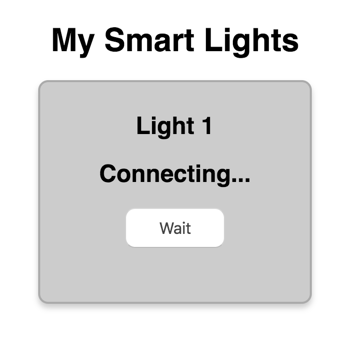

# 3.8 Web App CSS

Next you'll add the CSS for your web app's stylesheet.

## Add CSS

Copy this CSS, and paste it into a **blank** CSS file named `style.css`:

```css
body {
    font-family:  Helvetica, Arial, sans-serif;
    font-size: 1em;
    text-align: center;
}

.card {
    width: 250px;
    height: 200px;
    margin: 0 auto 20px;
    padding: 10px;
    background-color: #ccc; /* gray */
    border: 2px solid #aaa;
    border-radius: 10px;
    box-shadow: 0px 4px 8px rgba(0,0,0,0.2);
}

.light-on {
    background-color: #ffff99; /* yellow */
}

button {
    width: 100px;
    padding: 10px;
    font-size: 1em;
    color: #444;
    background-color: white;
    border-radius: 10px;
}
```

As you can see, this CSS has style declarations for 4 types of elements in your HTML:

1. The CSS for `body` styles the `<body>` section in your HTML.
2. The CSS for `.card` styles elements in your HTML that have `class="card"`. The `<div>` element has this class.
3. The CSS for `.light-on` styles any elements in your HTML that have `class="light-on"`. Currently, **no** elements have this class. However, your web app JS will add this class to the `<div>` element if your light is turned on and will remove this class if your light is turned off.
4. The CSS for `button` styles the `<button>` elements in your HTML.

## Preview Web App

If you preview the web app at this point, you can see how the CSS has changed the appearance of the web app, but it still doesn't function yet \(because there's still no JS in the `code.js` file\).



