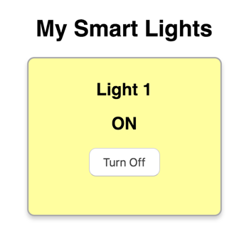

# C-9 Web App JS

Next, you'll add JavaScript code to allow your web app to interact with your Photon device through Particle Cloud. Remember that the web app will perform these two tasks:

1. The web app will display whether the LED light is currently turned on or off. The web app will do this by getting the current value of the `lightStatus` variable in your Photon device app.
2. The web app will display a button that can be clicked to remotely turn the LED light on or off. The web app will do this by calling the `toggleLight()` function in your Photon device app.

## Create Particle Object {#create-particle-object}

The Particle API JS library defines a class named `Particle()` which you'll use to create an [object](https://www.w3schools.com/js/js_objects.asp). An object is a special type of variable that has its own methods \(functions\) and properties \(variables\).

Copy this JavaScript code statement, and paste it into a **blank** JS file named `code.js`:

```javascript
var particle = new Particle();
```

This will create a new `Particle()` object and assign it to a global variable named `particle`. Your web app JS will use this object's methods to interact with Particle Cloud.

## Add Device ID & Access Token {#device-id-and-access-token}

In order for a web app to interact with a Photon device through Particle Cloud, the web app must provide the Photon's device ID and access token with each request. This ensures your web app interacts with the correct device – and prevents unauthorized apps from accessing your device.

You will declare global variables in your web app JS to store your Photon device ID and access token. You'll need to get their values from your Particle Build account.

Add this JS code to your `code.js` file, and modify it to list your Photon device ID and access token:

```javascript
var myDevice = "0000"; // Photon device ID
var myToken = "0000"; // Photon access token
```


**IMPORTANT:** You **must** modify this code to replace `"0000"` with your actual Photon device ID and access token. Otherwise, your web app will **not** work properly.


Your Photon's unique **device ID** is listed in the **Devices** menu of your Particle Build account:

1. Click the **Devices** icon in the left navigation bar.
2. In the **Devices** menu panel, click the drop-down arrow to the right of your Photon device name.
3. Select and copy the device ID.
4. Paste the device ID into your JS code as the value for `myDevice` \(the device ID must be listed within quotation marks\).

Your Photon's unique **access token** is listed in the **Settings** menu of your Particle Build account:

1. Click the **Settings** icon in the left navigation bar.
2. In the **Settings** menu panel, select and copy the access token.
3. Paste the access token into your JS code as the value for `myToken` \(the access token must be listed within quotation marks\).

## Get Device Variable

Your web app JS will use the `particle.getVariable()` method to get the value of a Photon device variable stored as a cloud variable in Particle Cloud.

Add this JS code to your `code.js` file:

```javascript
function checkLights(){
    particle.getVariable({ deviceId: myDevice, name: "lightStatus", auth: myToken }).then(function(data) {
        // add code to do something with value returned as: data.body.result
        if (data.body.result == "on") {
            $("#light1").addClass("light-on");
            $("#light1-status").html("ON");
            $("#light1-button").html("Turn Off")
        }
        else if (data.body.result == "off") {
            $("#light1").removeClass("light-on");
            $("#light1-status").html("OFF");
            $("#light1-button").html("Turn On")
        }
    }, function(err) {
            console.log("An error occurred: ", err);
    });
}
```

This adds a custom function named `checkLights()` to your JS. Inside this custom function is a call to the `particle.getVariable()` method.

The `particle.getVariable()` method requires your Photon device ID, the name of the cloud variable, and your Photon access token:

1. `myDevice` is the global variable that stores your Photon device ID
2. `"lightStatus"` is the name of the cloud variable whose value you want to get.
3. `myToken` is the global variable that stores your Photon access token

When Particle Cloud returns the value of your cloud variable, the value gets temporarily stored in a local variable called: `data.body.result`

In your Photon device app, the `lightStatus` variable has a value of either `"on"` or `"off"`. Therefore, in your web app JS, `data.body.result` will also be one of these values.

Inside the `particle.getVariable()` method are JS and jQuery code statements \(lines 4-13 above\) that were added to perform actions based on the value returned for the Photon variable.

An if-else statement is used to determine whether `data.body.result` has a value equivalent to `"on"` or `"off"`. Then jQuery statements \(which start with `$`\) are used to dynamically change the information displayed in the "card" by targeting specific [id selectors](https://www.w3schools.com/jquery/jquery_selectors.asp):

* `$("#light1")` targets the HTML element with `id="light1"` which is the `<div>` element that represents the "card" displaying the information for the light. The jQuery statements either add or remove the `light-on` CSS class \(which changes the card's background color to yellow\).
* `$("#light1-status")` targets the HTML element with `id="light1-status"` which is an `<h2>` element. The jQuery statements change this element's HTML to list either `ON` or `OFF`.
* `$("#light1-button")` targets the HTML element with `id="light1-button"` which is the `<button>` element that can be clicked to remotely turn the light on or off. The jQuery statements change this element's HTML to list either `Turn Off` or `Turn On` as the button's label.


**JAVASCRIPT:**  If you want to learn more about JS or need a quick reference, check out the [W3Schools JavaScript Tutorial and Reference](https://www.w3schools.com/js/default.asp).



**JQUERY:**  If you want to learn more about jQuery or need a quick reference, check out the [W3Schools jQuery Tutorial and Reference](https://www.w3schools.com/jquery/default.asp).


## Set Interval to Get Variable

If your web app needs to continuously monitor the value of a Photon variable, you can use the `window.setInterval()` method to automatically call a JS function at a set time interval \(such as every 5 seconds, etc.\).

Add this JS code statement to your `code.js` file:

```javascript
window.setInterval(checkLights, 200);
```

The `window.setInterval()` method requires two parameters inside its parentheses \(in this order\):

1. **The name of the JS function to be called**, which should be the name of the custom function in your JS that contains the `particle.getVariable()` method for the variable you need to monitor. The function's name should be listed **without** a set of parentheses. In this case,`checkLights` is the name of the function.
2. **The time interval between calls**, which will be the amount of time between each call to the JS function. The time interval is specified in milliseconds \(1000 ms = 1 second\). In this case, the interval was set to `200` ms \(every 0.2 seconds\).

## Call Device Function

Your web app JS will use the `particle.callFunction()` method to call a function in your Photon device app by calling its cloud function reference in Particle Cloud.

Add this JS code to your `code.js` file:

```javascript
function toggleLight1() {
    particle.callFunction({ deviceId: myDevice, name: "toggleLight", argument: "data", auth: myToken });
}
```

This adds a custom function named `toggleLight1()` to your JS. Inside this custom function is a call to the `particle.callFunction()` method.

The `particle.callFunction()` method requires your Photon device ID, the name of the cloud function, an argument \(a String parameter for the Photon function\), and your Photon access token:

1. `myDevice` is the global variable that stores your Photon device ID
2. `"toggleLight"` is the name of the cloud function that you want to call \(which will call its corresponding function in your Photon device app\)
3. `"data"` is the String parameter that will be passed into the Photon device function. If this text parameter isn't actually used within the Photon function, then it can be any text string enclosed within double quotation marks – even an empty text string of `""` will work.
4. `myToken` is the global variable that stores your Photon access token

The `<button>` in your web app HTML contains an [onclick event attribute](https://www.w3schools.com/tags/ev_onclick.asp) that will run this `toggleLight1()` function whenever the button in the web app is clicked.

## Test Web App

Be sure your Photon device is connected to Wi-Fi and Particle Cloud.

Refresh your web app, and test it with your Photon device to make sure they interact correctly:

* Verify that your web app displays the current status of your Smart Light. Use the push button connected to your Photon device to turn the LED light on or off. Verify that your web app updates automatically to show the correct light status.
* Verify that your web app can remotely turn your Smart Light on and off. Click the button in your web app, and verify that your Photon device automatically toggles the LED light on or off.



## Going Further

In the next tutorial, you'll modify your "Smart Light" device into a "Smart Security" device by adding a motion sensor and speaker to your existing LED light and push button. Then you'll program a new Photon app and new web app for the modified device.

