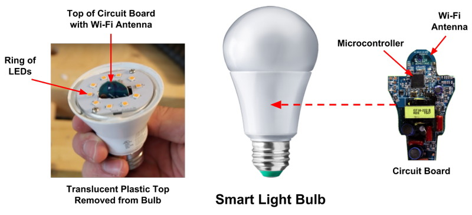

# 3. Smart Light Device

In this third tutorial, you'll create a "Smart Light" device and program its apps.

## Tutorial Goals

The goals of this third tutorial are to help you:

* Practice connecting physical inputs and outputs to your Photon device
* Program a Photon app that controls your device's physical inputs and outputs
* Program a web app that interacts with your Photon device through Particle Cloud

## What is a Smart Light?

The [Philips Hue](http://www2.meethue.com/en-us/) smart light bulb was introduced in 2012. Today, there are several companies that offer smart light bulb systems.

From the outside, a smart light bulb looks like a regular light bulb. However, what seems like a simple light bulb is actually a full-fledged IoT device:  inside the bulb are multiple LED lights wired to a microcontroller circuit board that connects to your Wi-Fi network.

The smart light interacts with a mobile app that allows you to control an individual light or a group of lights. The mobile app might offer features such as:

* Remotely turn the light\(s\) on or off
* Set automatic timers to turn the light\(s\) on or off at specific times
* Adjust the brightness of the light\(s\)
* Change the color of the light\(s\)
* Sync the light\(s\) to music, movies, or games
* Control the light\(s\) using a voice assistant \(such as: Alexa, Siri, etc.\)

For this tutorial, you'll create a prototype of a Smart Light device using one LED. Your device will include a button to manually turn the light on or off. You'll program a Photon device app to control the LED using the button. You'll also program a web app that interacts with your Photon device over the internet to monitor the light's status and to allow you to remotely turn the light on or off.

