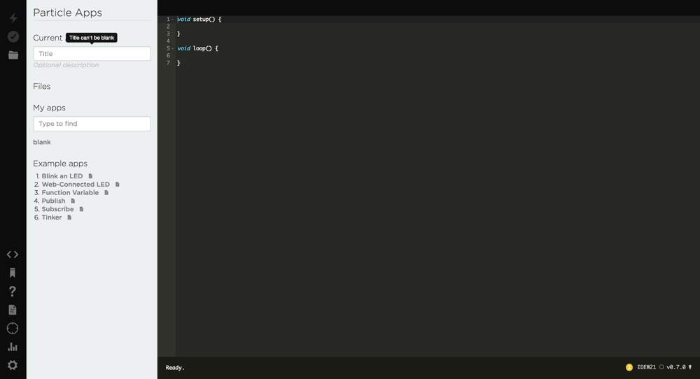
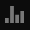

# 2.2 Login to Web IDE

Now that your Photon is connected to Wi-Fi and Particle Cloud, your team will log in to Particle Build, the code editor that will be used to create your "Hello World" app.

## What is Particle Build?

**Particle Build** is an online code editor \(web IDE\) provided by Particle.  Particle Build is part of the Particle Cloud platform. You will use Particle Build to code and store all your Photon device apps.

The Photon device itself can only store and run **one** app at a time. However, you can create and save multiple apps in Particle Build. When you need to update the specific app stored on your Photon device, you'll do this in Particle Build – and your Photon will download the new app over Wi-Fi.

Your team will need a Particle account to log in to Particle Build.  However, your teacher will most likely provide your team with an **existing** Particle account login \(email & password\) that's already associated with your specific Photon device. Every Photon has a unique device ID it uses to communicate with Particle Cloud, and each device ID can only be associated with one Particle account.

## Log In to Particle Build

One person on your team should log in to [Particle Build](https://login.particle.io/build) using your team's Particle account login.

Once you're logged in, you'll see the Particle Build code editor, which defaults to the "Code" menu and shows a blank app template.

### User Interface

The user interface for Particle Build is divided into 4 sections:

* On the far left is a vertical navigation bar with icons.
* On the middle left is a menu panel showing options for the current navigation selection.
* On the right side is the code editor panel showing the code for your current app.
* On the bottom of the code editor panel is a horizontal status bar that displays messages.

### Navigation Bar

If you hover your mouse pointer over an icon in the navigation bar, the icon's name will be displayed. Here is a summary of the navigation icons from top to bottom:

| Icon | Name | Purpose |
| :--- | :--- | :--- |
|   | **Flash** | Flashes the current app to your Photon device over Wi-Fi \(The app will first be saved and verified. If there are errors in the app, it will **not** be flashed.\) |
|   |  **Verify** | Complies the current app to check for errors \(The app will first be saved.\) |
|   | **Save** | Saves the current app in Particle Build |
|   | **Code** | Lists all your saved apps. Click an app's title to open it in the code editor. |
|   | **Libraries** | Lists libraries that can be included in your app to add functionality |
|   | **Help** | Lists quick help for device \(might not be available for your Photon\) |
|   | **Docs** | Opens new tab with Particle Reference Documentation for your device |
|   | **Devices** | Lists your devices. You can view the device ID, and signal device over Wi-Fi. \(If you have multiple devices, you can select which device to flash apps to.\) |
|   | **Console** | Opens new tab with Console showing your device's events in Particle Cloud |
|   | **Settings** | Provides options to:  log out, change password, or get your access token. |

### Toggle Menu Panel

The middle menu panel can be toggled between "show" and "hide" by clicking the same navigation icon repeatedly.

In the left navigation bar, click the **Code** icon.

The middle menu panel will become hidden.

Click the **Code** icon again to show the menu panel again.

In general, you'll probably want to keep the menu panel shown – but if you want extra space for your code editor panel, you can temporarily hide the menu panel.

## View Devices Menu

In the left navigation bar, click the **Devices** icon.

The middle menu panel will list your Particle devices. You should see a device name listed under P1 \(because your device is a Photon P1\). Your device's connection status is shown as a colored dot to the right of its name.  If your device is connected to Wi-Fi and Particle Cloud, the dot should be cyan \(light blue\) and "breathing" \(slowly blinking\) – just like the RGB LED on your Photon circuit board.

Click the drop-down arrow to the right of the device's connection status dot. This will show additional information about your device:

* You'll see the **device ID**, which is a unique ID used by your device to interact with Particle Cloud. Later when you create web apps to interact with your device, you'll need your device ID.
* You'll see the **firmware version** that is currently saved on your device. If an updated version is available, your device's firmware will be automatically updated the next time you flash an app.

### Signal Device

If you wanted to double-check your device and its connection \(imagine you had multiple devices\), an easy way is to signal it from Particle Build.

Click the **Signal** button. Particle Cloud will send a signal to your device over Wi-Fi. Your Photon's RGB LED will respond by cycling through a rainbow of colors.

Click the button again to stop signaling your device. Your Photon's RGB will return to breathing cyan.

## Return to Code Menu

In the left navigation bar, click the **Code** icon to return to your list of apps.

