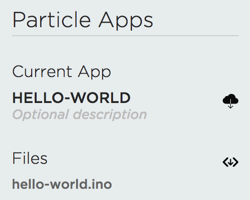

# 2.8 Modify App

Your last step is to modify the "Hello World" app, as some extra practice.

## Modify App Code

In Particle Build, modify the code within the `loop()` function to change the D7 LED blinking pattern. Here are some possible options your team could choose:

* Make the D7 LED blink faster
* Make the D7 LED blink slower
* Make the D7 LED blink in a different pattern \(such as two quick blinks followed by a longer pause\)

## Flash Modified App

Flash your modified app to your Photon to confirm it does what you intended it to do.

Your teacher may want to see your modified app code and see it running on your Photon.

## Download Copy of App

If you need to download a copy of your app code to your computer in order to submit it to your teacher, there are two different download icons shown in the Code Menu panel:

1. The **first icon** \(cloud with download arrow\) to the right of "Current App" is used to download the compiled version of the app \(firmware binary\)
2. The **second icon** \(angle brackets with download arrow\) to the right of "Files" is used to download a zip file containing your app source code \(`.ino` file\)

Click the **second** download icon to download a zip file containing your `hello-world.ino` file.


**UNCOMPRESS ZIP:**  To uncompress a zip file on a Windows computer, right-click the zip file, and select "Extract All." Then browse to a destination folder where you want to save the uncompressed file, and click the "Extract" button.

To uncompress a zip file on a Mac computer, just double-click the zip file.


