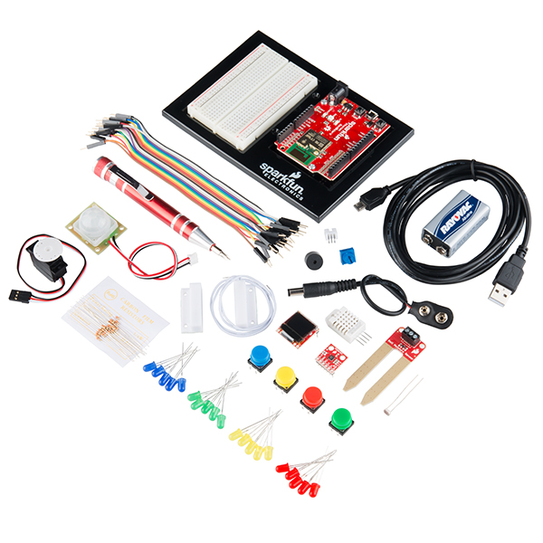

# 1. Meet Your IoT Kit

## Tutorial Goals

The goals of this first tutorial are to help you:

* Understand the features of your IoT circuit board \(LEDs, buttons, pins, ports\)
* Identify the other parts in your IoT kit and their purposes \(inputs, outputs, connectors/cables\)
* Understand how to connect parts to the IoT circuit board to create simple circuits \(use of pins, jumper wires, breadboard, and power\)

## Photon Kit

This guidebook is tailored for an IoT electronics kit called the [SparkFun Inventor's Kit for Photon](https://www.sparkfun.com/products/13320), which will simply be referred to as the Photon kit.

[SparkFun](https://www.sparkfun.com/) is a company that sells products to help people build and program electronics devices. [Photon](https://www.particle.io/products/hardware/photon-wifi) is a Wi-Fi enabled microcontroller \(small computer\) from a company called [Particle](https://www.particle.io/) that sells IoT hardware and services that help inventors and other companies create their own IoT products.

SparkFun created its own Photon kit by incorporating the Photon P1 microcontroller into an easy-to-use circuit board and packaged it with a set of inputs, outputs, wires, and other parts to help you start inventing your own IoT devices. It is also possible to purchase additional parts \(sensors, motors, etc.\) that can be used with this Photon kit.

