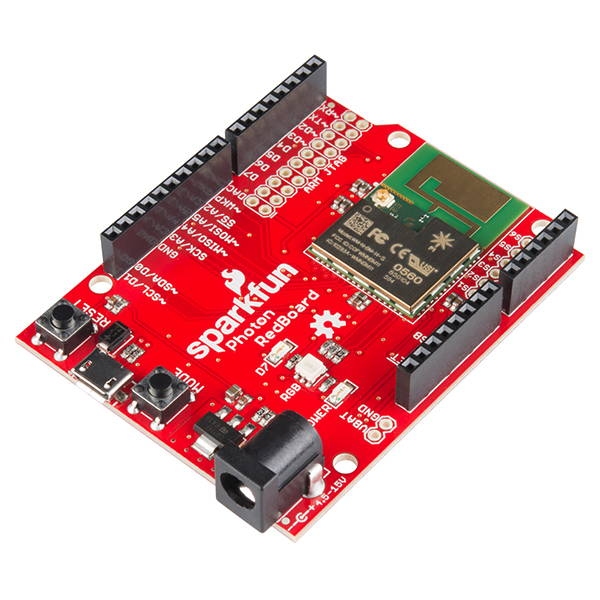
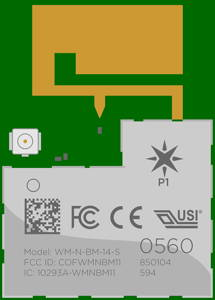

# 1.1 Circuit Board


**GOAL:** Understand the features of your IoT circuit board \(pins, ports, buttons, LED lights\)


## Circuit Board

The SparkFun Photon kit contains a printed circuit board \(PCB\) that incorporates the Particle Photon P1 microcontroller, which will act like the “brain” of your IoT device. This circuit board also has various pins, ports, buttons, and LED lights. SparkFun refers to this circuit board as the Photon RedBoard \(because of its color\).

### SparkFun Photon RedBoard

* Photon P1 Microcontroller
* Input/Output Pins
* Power Ports and Pins
* Buttons
* LED Lights

## Photon Microcontroller

A microcontroller is a small computer on a single integrated circuit that contains a processor \(CPU\), memory, storage, and programmable input/output pins. The Photon microcontroller also has an integrated Wi-Fi chip, which makes it great for IoT devices.

### Photon P1 Tech Specs

* **CPU:** 32-bit 120Mhz ARM Cortex M3
* **Memory:** 128KB RAM
* **Storage:** 1MB Flash
* **Wi-Fi:** 2.4GHz 802.11b/g/n

Compared to the tech specs of a "regular" computer, a microcontroller is much less powerful – it has a slower processor, less memory, and less storage. This is because microcontrollers are used in devices that have **dedicated** functions \(such as: automobile engine control systems, medical devices, remote controls, office machines, appliances, toys, etc.\). These dedicated devices typically don’t require as much computing power as general purpose computers \(such as: phone, tablet, desktop, etc.\) that perform many different functions.

## Input/Output Pins

The Photon circuit board has numerous I/O pins used to connect various **inputs** \(such as: sensors, buttons, etc.\) and **outputs** \(such as: motors, lights, etc.\). Most of these I/O pins have small plugs that allow you to easily connect \(and disconnect\) the wires for inputs and outputs.

### Digital Pins

The circuit board has a set of digital pins labeled as: D0, D1, D2, D3, D4, D5, D6, D7. Digital pins are used to connect inputs or outputs that use **binary values** \(such as: HIGH or LOW, etc.\). For example:

* **Digital Input:**  A motion sensor detects either "motion" or "no motion."
* **Digital Output:**  A LED light can be set to be "on" or "off."

### Analog Pins

The circuit board has a set of analog pins labeled as: A0, A1, A2, A3, A4, A5.  Analog pins are used to connect inputs or outputs that use a **range of values** \(such as: 0-255, etc.\) For example:

* **Analog Input:**  A photocell can detect a range of values based on the amount of light measured.
* **Analog Output:**  A speaker can produce a range of tones that have different frequencies.


**TWIN PINS:**  Analog pins A2, A3, A4, and A5 are each represented by **two** pins on the Photon board. The duplicate pins are labeled as: SS/A2, SCK/A3, MISO/A4, MOSI/A5.

If you use one of these pins, then you should **not** use its twin. For example, you could connect a part to either A2 or SS/A2 \(choose only one\), but you could **not** connect two different parts to these twin pins.


### Analog Output Using PWM

Any analog pin can be used for analog inputs. However, only certain pins can be used for analog outputs. \(Confusingly, some of the pins capable of analog output are labeled as digital pins.\)

The Photon microcontroller uses [pulse-width modulation](https://learn.sparkfun.com/tutorials/pulse-width-modulation) \(PWM\) to make a digital output signal \(which has only two values: HIGH or LOW\) act like an analog output signal \(which has a range of values\). Certain outputs \(such as: speaker, servo motor, etc.\) require a connection to a pin capable of PWM.

These pins can be used as analog outputs using PWM:  D0, D1, D2, D3, A4, A5.

### Special Pins

The circuit board also has I/O pins with "special" labels. Most of these "special" pins are used to connect with parts that require specific data communication protocols:

* **SPI Pins:**  SS/A2, SCK/A3, MISO/A4, MOSI/A5
  * SPI stands for "Serial Peripheral Interface"
  * For example, a Micro OLED display would be connected using the SPI pins.
* **I2C Pins:**  SDA/D0, SCL/D1
  * I2C stands for "Inter-Integrated Circuit"
  * For example, an accelerometer would be connected using the I2C pins.
* **UART Pins:** RX, TX
  * UART stands for "Universal Asynchronous Receiver-Transmitter"
  * For example, a fingerprint scanner would be connected using the UART pins.

However, any of these "special" pins can also be used as "regular" I/O pins.

