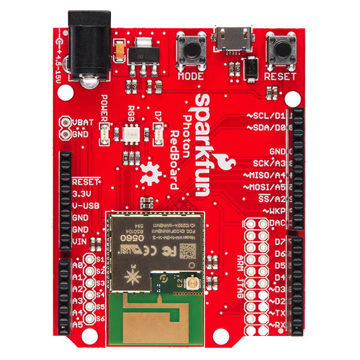

# 1.1 Circuit Board


**GOAL:** Understand the features of your IoT circuit board \(pins, ports, buttons, LED lights\)

**TASK:**  Review the information below, and answer the questions in [this document](https://drive.google.com/open?id=1eARpika3Wp3QeKaieGywfxVj4zWdHj-DtCyVGLkNZrw).


## Circuit Board

The SparkFun Photon kit contains a printed circuit board \(PCB\) that incorporates the Particle Photon P1 microcontroller, which will act like the “brain” of your IoT device. This circuit board also has various pins, ports, buttons, and LED lights. SparkFun refers to this circuit board as the Photon RedBoard \(because of its color\).

You can connect various inputs \(such as: sensors, buttons, etc.\) and outputs \(such as: motors, lights, etc.\) to the pins on the circuit board to create a device. Then you can control your device by programming an app that will run on the Photon microcontroller.

### SparkFun Photon RedBoard

* Photon P1 Microcontroller
* Input/Output Pins
* Power Supply Ports and Pins
* Buttons
* LED Lights

## Photon Microcontroller

A microcontroller is a small computer on a single integrated circuit that contains a processor \(CPU\), memory, storage, and programmable input/output pins. The Photon microcontroller also has an integrated Wi-Fi chip and antenna, which makes it great for IoT devices.

### Photon P1 Tech Specs

* **CPU:** 32-bit 120Mhz ARM Cortex M3
* **Memory:** 128KB RAM
* **Storage:** 1MB Flash
* **Wi-Fi:** 2.4GHz 802.11b/g/n

Compared to the tech specs of a "regular" computer, a microcontroller is much less powerful – it has a slower processor, less memory, and less storage. This is because microcontrollers are used in devices that have **dedicated** functions \(such as: automobile engine control systems, medical devices, office machines, appliances, etc.\). These dedicated devices typically don’t require as much computing power.

### Firmware and Device App

A microcontroller is controlled by its firmware, which acts as its operating system. Periodically, your Photon will need to update its firmware. If this is necessary, the firmware update will occur automatically when you download a new app to your Photon over Wi-Fi.

A microcontroller is designed to store **only one app**, which will run automatically. If you need to change your Photon device's app, the new app has to be downloaded over Wi-Fi \(and will replace the old app\). You will have to code the apps for your Photon – though you'll get some practice and help to do so.

## Input/Output Pins

The Photon circuit board has numerous I/O pins used to connect various **inputs** \(such as: sensors, buttons, etc.\) and **outputs** \(such as: motors, lights, etc.\). These I/O pins have small plugs that allow you to easily connect \(and disconnect\) the wires for inputs and outputs.

### Digital Pins

The circuit board has a set of digital pins labeled as: D0, D1, D2, D3, D4, D5, D6, D7. Digital pins are used to connect inputs or outputs that use **binary values** \(such as: HIGH or LOW, etc.\). For example:

* **Digital Input:**  A motion sensor detects either "motion" or "no motion."
* **Digital Output:**  A LED light can be set to be "on" or "off."

### Analog Pins

The circuit board has a set of analog pins labeled as: A0, A1, A2, A3, A4, A5.  Analog pins are used to connect inputs or outputs that use a **range of values** \(such as: 0-255, etc.\) For example:

* **Analog Input:**  A photocell can detect a range of values based on the amount of light measured.
* **Analog Output:**  A speaker can produce a range of tones that have different frequencies.


**TWIN PINS:**  Analog pins A2, A3, A4, and A5 are each represented by **two** pins on the Photon board. The duplicate pins are labeled as: SS/A2, SCK/A3, MISO/A4, MOSI/A5.

If you use one of these pins, you should **not** use its twin. For example, you could connect a part to either A2 or SS/A2 \(choose only one\), but you could **not** connect two different parts to these twin pins at the same time.


### Analog Output Using PWM

Any analog pin can be used for analog inputs. However, only certain pins can be used for analog outputs. \(Confusingly, some of the pins capable of analog output are labeled as digital pins.\)

The Photon microcontroller uses [pulse-width modulation](https://learn.sparkfun.com/tutorials/pulse-width-modulation) \(PWM\) to make a digital output signal \(which has only two values: HIGH or LOW\) act like an analog output signal \(which has a range of values\). Certain outputs \(such as: speaker, servo motor, etc.\) require a connection to a pin capable of PWM.

These pins can be used as analog outputs using PWM:  D0, D1, D2, D3, A4, A5.

### Special Pins

The circuit board also has I/O pins with "special" labels. Most of these "special" pins are used to connect with parts that require specific data communication protocols:

* **SPI Pins:**  SS/A2, SCK/A3, MISO/A4, MOSI/A5
  * SPI stands for "Serial Peripheral Interface"
  * For example, a Micro OLED display would be connected using the SPI pins.
* **I2C Pins:**  SDA/D0, SCL/D1
  * I2C stands for "Inter-Integrated Circuit"
  * For example, an accelerometer would be connected using the I2C pins.
* **UART Pins:** RX, TX
  * UART stands for "Universal Asynchronous Receiver-Transmitter"
  * For example, a fingerprint scanner would be connected using the UART pins.

However, any of these "special" pins can also be used as "regular" I/O pins.

## Power Supply Ports and Pins

The Photon circuit board must receive power from an external power source \(such as: USB, battery, or outlet\). The Photon circuit board will then supply power to any connected inputs and outputs.

### Power Supply Ports

The Photon circuit board can receive power through either one of its power supply ports:

* **Barrel Jack:**  A barrel jack adapter can be plugged in to provide power from an external supply such as a battery or outlet. The Photon kit includes a barrel jack adapter to connect a 9V battery.
* **USB:**  A Micro-USB cable can be plugged in to provide power from a computer's USB port or a USB charger. The Photon kit includes a USB to Micro-USB cable.


**CAUTION:**  Be careful when plugging or unplugging the Micro-USB cable to avoid breaking the USB port on the Photon circuit board. Be sure the correct side of the cable is facing up.


### Power Supply Pins

The Photon circuit board can supply power to inputs and outputs through these pins:

* **I/O Pins:**  These pins can supply 3.3 volts \(by reducing the incoming voltage from the USB or barrel jack power source\). Certain inputs and outputs \(but **not** all\) get their power from an I/O pin.
* **3.3V:**  This pin supplies 3.3 volts \(by reducing the incoming voltage from the USB or barrel jack power source\).
* **V-USB:**  If a USB power source is connected, this pin supplies ~5 volts.
* **VIN:**  If an external power supply is connected to the barrel jack, this pin supplies the same voltage as the external supply \(which could range from 4.5-15 volts\).  For example, if a 9V battery adapter is plugged into the barrel jack, this pin would supply 9 volts.
* **GND:**  This pin acts as the ground \(negative terminal\) when powering inputs and outputs. The Photon circuit board has 3 available GND pins.

A breadboard can be used to connect multiple inputs and outputs to the same power supply pins. The third section of this tutorial will explain how to do this.


**CAUTION:**  The inputs and outputs in your Photon kit have different power requirements:

* Certain inputs and outputs \(such as: accelerometer, micro OLED display, etc.\) require only 3.3 volts of power – using a higher voltage could damage these parts.
* Certain inputs and outputs \(such as: motion sensor, servo motor, etc.\) require 5 volts of power or more – using a lower voltage could prevent these parts from working.


## Buttons

The Photon circuit board has two built-in buttons used for special purposes:

* **Mode:**  This button is used to switch your Photon between different modes such as: Connected, Listening, Safe, and Device Firmware Upgrade. Normally, you will **not** need to use this button. 
* **Reset:**  This button can be used to restart your Photon – forcing it to reconnect to the internet and restart its device app. Occasionally, you might use this button to restart your app.

## LED Lights

The Photon circuit board has three built-in LED lights:

* **Power:**  This red LED indicates the Photon is receiving power \(from the barrel jack or USB\).
* **RGB:** This LED indicates the Photon's network status using [different colors and blinking patterns](https://docs.particle.io/guide/getting-started/modes/photon/https://docs.particle.io/guide/getting-started/modes/photon/).
* **D7:**  This blue LED is connected to the D7 pin and can be controlled by your Photon device app, which can be helpful for testing purposes.

## More Info

The [SparkFun Photon RedBoard Hookup Guide](https://learn.sparkfun.com/tutorials/photon-redboard-hookup-guide) provides more details about this circuit board. 

