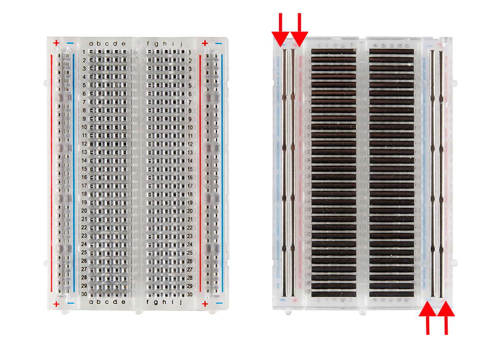

# 1.3 Electric Circuits


**GOAL:**  Understand how to create electric circuits by connecting parts to the IoT circuit board \(use of power pins, I/O pins, jumper wires, and breadboard\)

**TASK:** Review the information below to begin to understand how to use the parts in your Photon kit to create electric circuits, and answer the questions in [this document](https://drive.google.com/open?id=1puJb7vPXNY9-1fQx_PbVkhg7Pjbi81dnUu7ig8-Ytg4).


## Electric Circuits

Each input and output connected to your Photon circuit board must form an [electric circuit](https://www.dummies.com/programming/electronics/components/what-is-an-electronic-circuit/), which is a continuous path that conducts electricity from the positive \(+\) end of a power source through a "load" \(such as an input or output\) and back to the negative \(-\) end of the power source.

Each input and output connected to your Photon should have its own electric circuit – i.e., its own separate path that conducts electricity without having to travel through another input or output. These are called **parallel** circuits. Using parallel circuits has these advantages:

* Parallel circuits ensure each input and output receives the full voltage from the circuit board \(because the voltage is **not** being split with another input or output on the same circuit\).
* Parallel circuits allow each input and output to be independently controlled by the circuit board.


**AVOID SHORT CIRCUITS:**  Do **NOT** try this, but if you were to connect a wire directly from the positive side of a power source to the negative side \(without any input or output in the middle to act as the "load"\), you'd create a [short circuit](https://en.wikipedia.org/wiki/Short_circuit) that leads to excessive current flow.

Short circuits can possibly:  burn up your wire, damage your circuit board, damage your USB power supply, damage or drain your battery, etc.


## Power for Circuit Board

The power for your circuits will be supplied by the Photon circuit board, which itself must receive power from another source.

The Photon circuit board can receive power through either one of its power supply ports:

* **Barrel Jack:**  A barrel jack adapter can be plugged in to provide power from an external supply such as a battery or outlet. The Photon kit includes a barrel jack adapter to connect a 9V battery.
* **USB:**  A Micro-USB cable can be plugged in to provide power from a computer's USB port or a USB charger. The Photon kit includes a USB to Micro-USB cable.


**CHOOSE ONE:**  Only **one** power source \(USB or 9V battery\) needs to be connected to the Photon circuit board. Using a USB power source offers the advantage of not having to replace batteries, while using a battery power source offers the advantage of mobility.



**CAUTION:**  Be careful when plugging or unplugging the Micro-USB cable to avoid breaking the USB port on the Photon circuit board. Be sure the correct side of the cable is facing up.


## Power for Inputs and Outputs

The Photon circuit board can supply power to inputs and outputs through these pins:

### Positive Pins

* **I/O Pins:**  These pins can supply 3.3 volts \(by reducing the incoming voltage from the USB or barrel jack power source\). Only certain inputs and outputs will get their power from an I/O pin.
* **3.3V:**  This pin supplies 3.3 volts \(by reducing the incoming voltage from the USB or barrel jack power source\).
* **V-USB:**  If a USB power source is connected, this pin supplies ~5 volts.
* **VIN:**  If an external power supply is connected to the barrel jack, this pin supplies the same voltage as the external supply \(which could range from 4.5-15 volts\).  For example, if a 9V battery with adapter is plugged into the barrel jack, this pin would supply 9 volts.

### Negative Pins

* **GND:**  This pin acts as the ground \(negative terminal\) when powering inputs and outputs. The Photon circuit board has 3 available GND pins.


**CAUTION:**  The inputs and outputs in your Photon kit have different power requirements:

* Certain inputs and outputs \(such as: micro OLED display, etc.\) require **only 3.3 volts** of power – using a higher voltage could damage these parts.
* Certain inputs and outputs \(such as: servo motor, etc.\) require **5 volts or more** – using a lower voltage could prevent these parts from working.


Sometimes an input or output will connect **directly** to pins on the Photon board, and sometimes the input or output will connect **indirectly** to the Photon pins by using the breadboard and jumper wires.

## Breadboard

A breadboard has a large number of additional pins \(plugs\) that are useful for connecting inputs and outputs to your circuit board. First, your inputs and outputs connect to pins in the breadboard, and then jumper wires are used to help connect those breadboard pins to specific pins on your circuit board.

One purpose of using a breadboard is it allows you to connect multiple inputs and outputs to some of the same power supply pins – while still ensuring each input and output has its own parallel circuit.

For example, the Photon circuit board has only one V-USB pin to supply 5V of power, but your device might have multiple inputs and outputs that require 5V – so the breadboard can be used to allow these parts to share this one V-USB pin.

### Anatomy of Breadboard

To understand how a breadboard works and is used, you need to understand the "anatomy" of your breadboard.  The image on the left below shows an external view of your breadboard, while the image on the right shows what's inside the breadboard:

First, let's examine the external view of your breadboard. While the breadboard might seem like one large rectangle of holes, it actually consists of 4 smaller rectangular sections:

1. On the far left is a **power rail** consisting of two columns of pins:  one column is labeled as positive \(+\) and the other column is labeled as negative \(-\).
2. In the left center is a set of **terminal strips** consisting of rows of pins:  each row is numbered \(from 1-30\) and the pins within each row are lettered \(from a-e\).
3. In the right center is another set of **terminal strips** consisting of rows of pins:  each row is numbered \(from 1-30\) and the pins within each row are lettered \(from f-j\). Notice there is a divide between the left set of terminal strips and the right set of terminal strips.
4. On the far right is another **power rail** consisting of two columns of pins:  one column is labeled as positive \(+\) and the other column is labeled as negative \(-\).

Inside the breadboard, there are metal strips underneath the pin holes. The image of the internal view shows these metal strips – and makes it easier to visualize the 4 separate sections of the breadboard.  \(The red arrows are pointing to the metal strips under the power rails.\)

When you plug a wire into a breadboard pin, the wire makes contact with the specific metal strip underneath that pin location. If another wire is plugged into another pin along the **same** metal strip, that metal strip will allow electricity to be conducted between the wires. If the wires are touching **different** metal strips, then the wires are **NOT** connected to each other.

While these metal strips may be "hidden" inside your breadboard, they will become part of your circuits as you connect inputs and outputs to your Photon.

Here are some examples to help explain further:

* If you were to plug a wire into pin "a" of row 1 on the breadboard and then plug another wire into pin "e" of row 1, these wires would be connected because they're touching the **same** metal strip.
* If you were to plug a wire into pin "a" of row 1 on the breadboard and then plug another wire into pin "f" of row 1, these wires would **NOT** be connected because they're touching **different** metal strips. Remember that the terminal strip rows on the left and right sides are separate.
* If you were to plug a wire into pin "a" of row 1 on the breadboard and then plug another wire into pin "a" of row 2, these wires would **NOT** be connected because they're touching **different** metal strips. Remember that the terminal strip rows are separate from each other.
* If you were to plug a wire into a pin of the positive \(+\) column of the left power rail and then plug another wire into another pin in the positive \(+\) column of the left power rail, these wires would be connected because they're touching the **same** metal strip.
* If you were to plug a wire into a pin of the positive \(+\) column of the left power rail and then plug another wire into a pin of the negative \(-\) column of the left power rail, these wires would **NOT** be connected because they're touching **different** metal strips.
* If you were to plug a wire into a pin of the positive \(+\) column of the left power rail and then plug another wire into a pin of the positive \(+\) column of the right power rail, these wires would **NOT** be connected because they're touching **different** metal strips.

### Connecting Inputs and Outputs

Certain inputs or outputs can be connected directly to pins on the Photon circuit board. However, in most cases, you'll need to use the breadboard to help connect some \(or all\) of your inputs and outputs.

Each input or output has at least 2 wires that must be connected \(one for positive and the other for negative\). Some inputs or outputs have additional wires used for sending or receiving signals.

The wires for inputs and outputs connect to the pins of different terminal strips. Then jumper wires are used to connect each of these terminal strips directly \(or indirectly\) to its corresponding power pin or I/O pin on the Photon circuit board.

Here are two basic rules for connecting inputs and outputs to the breadboard:

* Different wires for the same part should **NOT** connect to pins in the same terminal strip. For example, the temperature sensor has 4 wires that should connect to different terminal strips.
  * **Jumper wires** are the only exception to this rule:  a jumper wire is supposed to share a terminal strip with a wire of an input or output in order to connect it directly \(or indirectly\) to its corresponding power pin or I/O pin on the circuit board.
* Wires for different parts should **NOT** connect to pins in the same terminal strip. For example, the wires of a push button and LED light should connect to different terminal strips.
  * [Resistors](https://learn.sparkfun.com/tutorials/resistors) are the only exception to this rule:  a resistor is supposed to share a terminal strip with a wire of an input or output because the purpose of the resistor is to limit the amount of electric current flowing through the input or output to prevent damaging them. The only parts in your Photon kit that require a resistor are LED lights and the photocell \(light sensor\). 

### Connecting Power Rails

Think of each power rail like a power strip you might use at home or school:  you first have to plug the power strip into an outlet, and then the power strip can provide power to other devices plugged into it. Since your breadboard has two power rails \(far left and far right\), it's like having two power strips.

Some IoT devices won't need to use either power rail on the breadboard. However, most IoT devices will use at least one power rail.  A few IoT devices might need to use both power rails \(if your device has multiple parts needing 3.3V and multiple parts needing 5V\).

In order to use a power rail on the breadboard to supply power to inputs or outputs, you must first use jumper wires to connect the power rail to power pins on the Photon circuit board:

* The positive \(+\) column of the power rail would connect to a positive \(+\) pin on the Photon board \(such as the 3.3V pin, V-USB pin, or VIN pin – do **NOT** connect to an I/O pin\). 
* The negative \(-\) column of the power rail would connect to a negative \(-\) pin on the Photon board \(any one of the GND pins\).

Sometimes you might **only** need to connect the negative \(-\) column of a power rail. This is because every input and output needs to connect back to GND \(and there are only 3 GND pins available on the Photon board\). Since certain inputs and outputs use their I/O pin as their voltage source \(+\), sometimes it might **not** be necessary to activate and use the positive \(+\) column of the power rail.

Once a power rail has been connected to power pins on the Photon circuit board, you can use jumper wires to connect multiple inputs and outputs to this same power rail:

* Use a jumper wire to connect the terminal strip for the ground \(-\) wire of the input or output to any negative \(-\) pin of the power rail.
* For inputs or outputs that don't get power from their I/O pin, use a jumper wire to connect the terminal strip for the power \(+\) wire of the input or output to any positive \(+\) pin of the power rail \(as long as that power rail supplies the correct voltage required by the input or output\).


All of this information about using jumper wires and the breadboard to connect inputs and outputs to the circuit board will really only make sense once you have **hands-on experience** building some practice devices. Tutorials 2-4 are designed to give you that experience.


## More Info

SparkFun has tutorials that provide more information about circuits and breadboards:

* [What is a Circuit?](https://learn.sparkfun.com/tutorials/what-is-a-circuit)
* [How to Use a Breadboard](https://learn.sparkfun.com/tutorials/how-to-use-a-breadboard)

